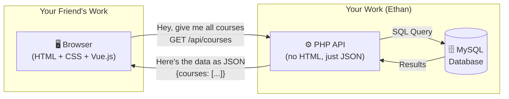
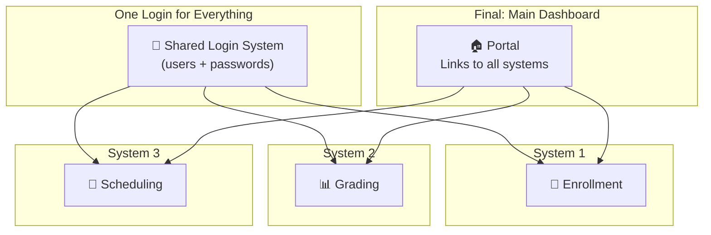

# 📘 The Complete Guide: Building Our Enrollment System (and Making It Scalable)

> **Who is this for?** Ethan (backend) and your frontend teammate. Read this together before writing any code.
>
> **What you already know:** You've built CRUD web apps before (probably PHP files that mix HTML and PHP together, forms that POST to the same page, etc.). That's a great foundation. This guide builds on that.

---

## 📖 Table of Contents

1. [What Are We Actually Building?](#1-what-are-we-actually-building)
2. [What Does "Scalable" Actually Mean?](#2-what-does-scalable-actually-mean)
3. [The Big Difference From What You've Done Before](#3-the-big-difference-from-what-youve-done-before)
4. [Understanding APIs — The Restaurant Analogy](#4-understanding-apis--the-restaurant-analogy)
5. [How Our System Will Work (Visual)](#5-how-our-system-will-work-visual)
6. [Your Roles: Who Does What?](#6-your-roles-who-does-what)
7. [The Enrollment System Features (MVP)](#7-the-enrollment-system-features-mvp)
8. [The Database: What Data Do We Store?](#8-the-database-what-data-do-we-store)
9. [How Systems Connect Later](#9-how-systems-connect-later)
10. [Tools We'll Use](#10-tools-well-use)
11. [Step-by-Step: How We Actually Build This](#11-step-by-step-how-we-actually-build-this)
12. [Discussion Points for You and Your Teammate](#12-discussion-points-for-you-and-your-teammate)
13. [Glossary: Terms You'll Hear a Lot](#13-glossary-terms-youll-hear-a-lot)

---

## 1. What Are We Actually Building?

**The semester goal:** Build multiple small systems (enrollment, grading, scheduling, etc.) and connect them all together at the end as one big School Management System.

**Right now:** We're building **System #1 — the Enrollment System**. Think of it as the system a school registrar uses to:
- Manage the list of courses (CS101, MATH101, etc.)
- Open sections for each course per semester (CS101 Section A, Section B...)
- Enroll students into sections
- Let students see what they're enrolled in

That's it. Nothing fancy. It's basically CRUD — but built in a smarter way so we can **add more systems later without breaking anything**.

---

## 2. What Does "Scalable" Actually Mean?

Forget the textbook definition. For us, **scalable** means three things:

### 🔧 "I can update one thing without breaking everything else"
> If you change how enrollment works, the grading system shouldn't crash. If your friend redesigns the UI, your backend code shouldn't need to change.

### ➕ "I can add new systems without rewriting old ones"
> When it's time to build the Grading System, you shouldn't have to rewrite the Enrollment System. The new system just plugs in.

### 👥 "Two people can work at the same time without stepping on each other"
> You work on backend. Your friend works on frontend. You shouldn't be waiting on each other or editing the same files.

**That's it.** We're not talking about handling millions of users or cloud servers. We're talking about writing code in a way that's **organized, separated, and easy to add to**.

---

## 3. The Big Difference From What You've Done Before

Here's what you've probably built before:

```
❌ THE OLD WAY (what you're used to)
┌──────────────────────────────────────────────┐
│                 students.php                  │
│                                              │
│  <?php                                       │
│    // Connect to database                    │
│    // Query students                         │
│    // Process form if submitted              │
│  ?>                                          │
│  <html>                                      │
│    <form action="students.php" method="POST">│
│      <!-- HTML form here -->                 │
│    </form>                                   │
│    <table>                                   │
│      <?php while($row = ...) { ?>            │
│        <tr><td><?= $row['name'] ?></td></tr> │
│      <?php } ?>                              │
│    </table>                                  │
│  </html>                                     │
└──────────────────────────────────────────────┘
```

**Everything is in one file.** PHP logic, HTML, database queries, form handling — all mashed together. This works fine for small projects, but:
- Your friend **can't work on the HTML** without risking breaking your PHP code
- You **can't reuse the backend** for a different system or a mobile app
- If you change the database, you have to hunt through HTML files to find where it's used

Here's what we're doing instead:

```
✅ THE NEW WAY (what we're building)

BACKEND (Ethan's territory)          FRONTEND (Friend's territory)
┌─────────────────────────┐          ┌─────────────────────────┐
│   Pure PHP files         │          │   Pure HTML/CSS/JS       │
│   No HTML at all         │   JSON   │   No PHP at all          │
│                         │◄────────►│                         │
│   Receives requests      │          │   Sends requests         │
│   Talks to database      │          │   Displays data          │
│   Returns JSON data      │          │   Handles user clicks    │
└─────────────────────────┘          └─────────────────────────┘
         │                                        │
         ▼                                        ▼
    ┌──────────┐                         Runs in the browser
    │  MySQL   │                         (just like any website)
    │ Database │
    └──────────┘
```

**The backend ONLY returns data (JSON).** It never outputs HTML.  
**The frontend ONLY displays things.** It never touches the database.  
**They talk to each other through an API** — which is just a URL that returns data instead of a webpage.

---

## 4. Understanding APIs — The Restaurant Analogy

If you've never built an API before, here's the simplest way to think about it:

```
🍽️ THE RESTAURANT

   Customer          Waiter           Kitchen
  (Frontend)         (API)           (Backend)
      │                │                │
      │  "I want       │                │
      │   adobo"       │                │
      ├───────────────►│                │
      │                │  Order: adobo  │
      │                ├───────────────►│
      │                │                │ (cooks the food /
      │                │                │  queries the database)
      │                │  Here's the    │
      │                │  adobo         │
      │                │◄───────────────┤
      │  🍛 Adobo      │                │
      │◄───────────────┤                │
      │                │                │
      │ (displays it   │                │
      │  on the plate/ │                │
      │  on the screen)│                │

```

- **The customer (frontend)** doesn't go into the kitchen. They just order.
- **The waiter (API)** carries the request to the kitchen and brings back the food.
- **The kitchen (backend)** doesn't care what the customer looks like. They just cook what's ordered.

### What This Looks Like in Code

**The old way** — the customer walks into the kitchen:
```php
// students.php — PHP mixed with HTML
<?php
$result = $conn->query("SELECT * FROM students");
?>
<table>
<?php while($row = $result->fetch_assoc()) { ?>
    <tr><td><?= $row['name'] ?></td></tr>
<?php } ?>
</table>
```

**The new way** — customer orders through the waiter:

**Backend (Ethan writes this):**
```php
// api/students.php — returns ONLY JSON, no HTML
<?php
$result = $conn->query("SELECT * FROM students");
$students = $result->fetchAll();

header('Content-Type: application/json');
echo json_encode([
    "status" => "success",
    "data" => $students
]);
```

**Frontend (Friend writes this):**
```html
<!-- students.html — pure HTML + JavaScript, no PHP -->
<table id="student-table">
    <!-- JavaScript will fill this in -->
</table>

<script>
// Ask the API for students
fetch('http://localhost/systemforsia/api/students')
    .then(response => response.json())
    .then(result => {
        // result.data = [{name: "Juan"}, {name: "Maria"}, ...]
        // Now use JavaScript to create <tr> rows and display them
    });
</script>
```

> [!TIP]
> **That's literally it.** The backend returns JSON. The frontend uses `fetch()` to get that JSON and displays it. That's what "API-first" means. Everything else is just organizing this pattern neatly.

---

## 5. How Our System Will Work (Visual)

### System 1: Enrollment (what we build now)



### End of Semester: All Systems Connected



**The key idea:** All systems share the **same login** (same users table). But each system has its **own database** and its **own code**. They're independent but connected through the shared login.

---

## 6. Your Roles: Who Does What?

### 🔧 Ethan (Backend Developer — You)

**Your job:** Build the "kitchen" — the PHP code that talks to the database and returns JSON.

| You DO | You DON'T |
|:--|:--|
| Write PHP files that return JSON | Write any HTML |
| Design and create the database tables | Design how things look on screen |
| Handle login/authentication logic | Care about colors, fonts, or layouts |
| Validate data (is this email valid? is this section full?) | Handle button clicks or form submissions |
| Decide what data the API sends back | Decide where things are positioned on the page |

**Your files:** All `.php` files and `.sql` files

---

### 🎨 Frontend Developer (Your Friend)

**Their job:** Build the "dining room" — the HTML pages that users actually see and interact with.

| They DO | They DON'T |
|:--|:--|
| Write HTML, CSS, and JavaScript | Write any PHP |
| Design the user interface (layout, colors, buttons) | Connect to the database directly |
| Use `fetch()` to call your API | Write SQL queries |
| Handle form submissions via JavaScript | Handle server-side logic |
| Show loading spinners, error messages, success alerts | Validate data on the server (you do that) |

**Their files:** All `.html`, `.css`, and `.js` files

---

### 🤝 What You Both Decide Together

Before either of you writes code, you sit down and agree on:

1. **What pages exist** — Login, Dashboard, Courses, Enrollment, etc.
2. **What data each page needs** — "The courses page needs: course code, title, units, and department"
3. **The API endpoints** — "To get courses, the frontend calls `GET /api/courses` and the backend returns a list"
4. **The response format** — What the JSON looks like (field names, structure)

> [!IMPORTANT]
> **This agreement is called the "API Contract."** Think of it as a menu — it lists everything the frontend can order and exactly what it will get back. Once you agree on the menu, both of you can work independently.

---

## 7. The Enrollment System Features (MVP)

MVP = Minimum Viable Product. Just the essentials, nothing fancy.

### What Users Can Do

| User | What They Can Do |
|:--|:--|
| **Admin / Registrar** | Add/edit/delete courses |
|  | Create semesters (1st Sem 2026-2027, etc.) |
|  | Open sections for courses (CS101 Section A, B, C...) |
|  | Enroll students into sections |
|  | View all enrollments |
| **Student** | View available courses and sections |
|  | See their own enrollment (what am I enrolled in?) |

### Pages We Need

| Page | Who Sees It | What's On It |
|:--|:--|:--|
| **Login** | Everyone | Email + password form |
| **Dashboard** | Admin/Registrar | Summary stats (total students, enrolled this sem) |
| **Courses** | Admin/Registrar | Table of courses with Add/Edit/Delete buttons |
| **Sections** | Admin/Registrar | Sections per course per semester with capacity |
| **Enroll Student** | Admin/Registrar | Pick student → pick sections → submit |
| **My Enrollment** | Student | "You are enrolled in: CS101-A, MATH101-B..." |

> [!NOTE]
> **For the MVP, only Admin/Registrar can enroll students.** Students just view their enrollment. Self-enrollment can be added later as an upgrade — that's what "scalable" means. We can add features without rebuilding.

---

## 8. The Database: What Data Do We Store?

Don't worry about SQL syntax yet. Just understand **what tables we need and why**.

### Table 1: `users` (shared — used by ALL future systems)
> "Who can log in?"

| Field | Example | Why |
|:--|:--|:--|
| id | 1 | Unique identifier |
| email | juan@school.com | Login credential |
| password | (encrypted) | Login credential |
| first_name | Juan | Display name |
| last_name | Dela Cruz | Display name |
| role | student / admin / registrar | Controls what they can see and do |

### Table 2: `courses`
> "What subjects does the school offer?"

| Field | Example | Why |
|:--|:--|:--|
| id | 1 | Unique identifier |
| course_code | CS101 | Short code everyone knows |
| title | Introduction to Computing | Full name |
| units | 3 | Credit units |

### Table 3: `semesters`
> "What time period are we in?"

| Field | Example | Why |
|:--|:--|:--|
| id | 1 | Unique identifier |
| name | 1st Semester 2026-2027 | Human-readable label |
| academic_year | 2026-2027 | For grouping |
| enrollment_open | yes / no | Can students enroll right now? |

### Table 4: `sections`
> "A specific class offering — one course can have many sections"

| Field | Example | Why |
|:--|:--|:--|
| id | 1 | Unique identifier |
| course_id | 1 (→ CS101) | Which course is this a section of? |
| semester_id | 1 (→ 1st Sem 2026-2027) | Which semester? |
| section_code | A | Section label |
| instructor | Dr. Santos | Who teaches it |
| schedule | MWF 9:00-10:00 AM | When it meets |
| max_students | 40 | Capacity limit |

### Table 5: `enrollments`
> "Who is enrolled in what?" — This connects students to sections.

| Field | Example | Why |
|:--|:--|:--|
| id | 1 | Unique identifier |
| user_id | 5 (→ Juan Dela Cruz) | Which student? |
| section_id | 1 (→ CS101-A) | Which section? |
| status | enrolled / dropped / pending | Current state |

### How the tables connect

```
users ──────┐
            │ (a student is enrolled in sections)
            ▼
        enrollments
            │
            ▼
sections ───┤
   │        │
   ▼        ▼
courses   semesters
```

> A **student** (from `users`) is **enrolled** (in `enrollments`) into a **section** (from `sections`), which belongs to a **course** and a **semester**.

---

## 9. How Systems Connect Later

This is the part that makes everything "scalable." Here's the key idea:

### The Shared Login

Every system you build later (grading, scheduling, library) will use the **same `users` table**. A student logs in once and all systems know who they are.

```
                    ┌── Enrollment System (has its own courses, sections, enrollments tables)
                    │
users table ────────┼── Grading System (has its own grades, assessments tables)
(shared login)      │
                    └── Scheduling System (has its own rooms, timeslots tables)
```

### Systems Can Read Each Other's Data

When you build the Grading System later, it needs to know what courses a student is enrolled in. Instead of duplicating data, the Grading System just **asks the Enrollment System's API**:

```
Grading System: "Hey Enrollment API, what is Student #5 enrolled in?"
Enrollment API: "CS101-A, MATH101-B, ENG101-A"
Grading System: "Great, now I know which courses to show grades for."
```

**This is why we build APIs.** Systems can talk to each other through them.

### The End-of-Semester Portal

At the end, you build a simple **Main Portal** page that links to all your systems:

```
┌─────────────────────────────────────┐
│         SCHOOL PORTAL               │
│   Welcome, Juan Dela Cruz!          │
│                                     │
│   ┌─────────┐  ┌─────────┐         │
│   │📝 Enroll│  │📊 Grades│         │
│   │  ment   │  │         │         │
│   └─────────┘  └─────────┘         │
│   ┌─────────┐  ┌─────────┐         │
│   │📅 Sched │  │📚 Library│        │
│   │  ule    │  │         │         │
│   └─────────┘  └─────────┘         │
└─────────────────────────────────────┘
```

Each box links to a separate system, but they all share the same login.

---

## 10. Tools We'll Use

### Both of You

| Tool | What For | Get It |
|:--|:--|:--|
| **XAMPP** | Runs PHP and MySQL on your laptop | [apachefriends.org](https://www.apachefriends.org/) |
| **VS Code** | Code editor | You probably already have this |
| **Git + GitHub** | Version control (save your work, collaborate) | [github.com](https://github.com/) |

### Ethan (Backend)

| Tool | What For |
|:--|:--|
| **Postman** or **Thunder Client** (VS Code extension) | Test your API endpoints without needing the frontend. You type in the URL, it shows you the JSON response. Essential. |
| **phpMyAdmin** (comes with XAMPP) | View and manage your MySQL database |

### Frontend Dev

| Tool | What For |
|:--|:--|
| **Browser DevTools** (F12) | Debug JavaScript, see network requests, check for errors |
| **Vue.js via CDN** | Add reactivity to HTML pages without installing anything. Just a `<script>` tag. |

---

## 11. Step-by-Step: How We Actually Build This

Here's the order. It's designed so you don't get overwhelmed — **do one step at a time**.

---

### Step 1: Setup (Do this together, 1 sitting)

```
☐ Install XAMPP (both of you)
☐ Create a GitHub repository called "systemforsia"
☐ Clone it to your computers
☐ Create the basic folder structure:
    systemforsia/
    ├── shared/          ← Login system (Ethan builds)
    ├── enrollment/
    │   ├── backend/     ← Ethan's territory
    │   └── frontend/    ← Friend's territory
    └── docs/            ← API contracts (you agree together)
☐ Agree on the API contract (see Step 2)
```

---

### Step 2: Agree on the API Contract (Do this together, 1 sitting)

**Before anyone writes code**, sit down and write out what the API looks like. This is your "menu."

For each endpoint, agree on:
1. **What URL to call** — `GET /api/courses`
2. **What you send** (for POST/PUT) — `{ "course_code": "CS101", "title": "Intro to Computing" }`
3. **What you get back** — `{ "status": "success", "data": [...] }`

Example contract (write this in `docs/api-contracts/enrollment-api.md`):

```
## Courses

### Get all courses
GET /enrollment/api/courses

Response:
{
    "status": "success",
    "data": [
        { "id": 1, "course_code": "CS101", "title": "Intro to Computing", "units": 3 },
        { "id": 2, "course_code": "MATH101", "title": "College Algebra", "units": 3 }
    ]
}

### Create a course
POST /enrollment/api/courses

Send:
{ "course_code": "CS101", "title": "Intro to Computing", "units": 3 }

Response:
{ "status": "success", "message": "Course created", "data": { "id": 3, ... } }
```

> [!TIP]
> **This is the most important step.** Once you have this contract, both of you can work independently. Ethan builds the backend to return this exact format. Friend builds the frontend to expect this exact format. You don't need to wait for each other.

---

### Step 3: Work in Parallel (This is where you split up)

#### Ethan's path (backend):

```
☐ 3a. Create the databases in phpMyAdmin (users, courses, semesters, sections, enrollments)
☐ 3b. Build a simple database connection helper (one PHP file you reuse everywhere)
☐ 3c. Build the Login API (POST /api/login → check password → return a token)
☐ 3d. Build Courses CRUD API (GET, POST, PUT, DELETE)
☐ 3e. Build Semesters CRUD API
☐ 3f. Build Sections CRUD API
☐ 3g. Build Enrollments API (enroll, drop, list)
☐ 3h. Test EVERYTHING with Postman before telling your friend it's ready
```

**Test with Postman as you go.** Every time you finish an endpoint, open Postman, send a request, and make sure the JSON looks right. Don't move on until it works.

#### Friend's path (frontend):

```
☐ 3a. Create the CSS design system (colors, fonts, card styles, button styles)
☐ 3b. Build the sidebar navigation layout (reuse across all pages)
☐ 3c. Build the Login page (use FAKE data for now — just make the form and the UI work)
☐ 3d. Build the Courses page (table with Add/Edit/Delete — use FAKE data)
☐ 3e. Build the Sections page (use FAKE data)
☐ 3f. Build the Enrollment page (use FAKE data)
☐ 3g. Build the My Enrollment page (use FAKE data)
```

> [!IMPORTANT]
> **"Use FAKE data" means:** Your friend creates a JavaScript file with hardcoded sample data (like `const courses = [{course_code: "CS101", ...}]`) and uses that to build and test all the pages. When your API is ready, they simply swap the fake data for a `fetch()` call to your API. The UI doesn't change at all. **This is how professionals do it.**

---

### Step 4: Connect Frontend to Backend (Do together, 1-2 sittings)

```
☐ Friend replaces fake data with real API calls (fetch)
☐ Test every page together — click every button, submit every form
☐ Fix any bugs (data format mismatches, missing fields, etc.)
☐ Test login → use token → access protected pages
```

---

### Step 5: Done with System #1! Plan System #2.

When Enrollment works, you repeat the process for the next system (Grading, Scheduling, etc.). Each new system:
- Gets its own `backend/` and `frontend/` folder
- Gets its own database
- Reuses the same login system
- Follows the same API pattern

---

## 12. Discussion Points for You and Your Teammate

When you sit down with your frontend friend, discuss these:

### ✅ Things to Agree On

1. **"What pages do we need?"** — List them out. Login, Dashboard, Courses, Sections, Enroll, My Enrollment. Anything else?

2. **"What should each page look like roughly?"** — Sketch on paper or whiteboard. Doesn't have to be pretty — just boxes showing where things go.

3. **"What data does each page need?"** — For the Courses page: course code, title, units. For Enrollment: student name, section, status. Write these down.

4. **"How do we handle login?"** — When someone logs in, the backend gives a "token" (like a wristband at a concert). The frontend saves it and shows it every time it makes a request. This is how the backend knows who's asking.

5. **"What color scheme and style?"** — Pick a primary color for the enrollment system. Dark mode or light mode? Sidebar or top navbar?

6. **"When will the API be ready?"** — Give your friend a realistic timeline. They can build the UI with fake data while waiting, but they need to know when to expect the real API for testing.

### ⚠️ Common Mistakes to Avoid

| Mistake | Why It's Bad | What To Do Instead |
|:--|:--|:--|
| Mixing PHP and HTML in the same file | Your friend can't work on the HTML without risking breaking PHP | Backend = only PHP (returns JSON). Frontend = only HTML/JS. |
| Not agreeing on the API contract first | You'll build mismatched code and waste time fixing it | Write the contract together before coding |
| Frontend waiting for backend before starting | Wastes time | Use fake data; swap for real API later |
| Not using Git | You'll overwrite each other's work | Commit often, use separate branches |
| Building too many features at once | You'll get overwhelmed and nothing works | Build one page at a time. Get it working. Then move on. |
| Not testing with Postman | You won't know if your API works until the frontend connects | Test every endpoint as you build it |

---

## 13. Glossary: Terms You'll Hear a Lot

| Term | Plain English |
|:--|:--|
| **API** | A URL that returns data (JSON) instead of a webpage. Like a waiter that takes orders and brings back food. |
| **REST API** | A specific style of API that uses standard methods: GET (read), POST (create), PUT (update), DELETE (remove). |
| **JSON** | A text format for data. Looks like: `{"name": "Juan", "age": 20}`. Both PHP and JavaScript understand it. |
| **Endpoint** | One specific API URL. Example: `GET /api/courses` is one endpoint. |
| **CRUD** | Create, Read, Update, Delete — the four basic operations on data. You already know this! |
| **Frontend** | The part users see and interact with (HTML, CSS, JavaScript). Runs in the browser. |
| **Backend** | The part users don't see (PHP, database). Runs on the server. |
| **Token / JWT** | A "pass" that proves you're logged in. Like a wristband at a concert — show it to access restricted areas. |
| **CORS** | A security rule that controls which websites can call your API. You'll need to configure this so the frontend can talk to the backend. |
| **MVP** | Minimum Viable Product — the smallest version that actually works. Build this first, add features later. |
| **Mock Data / Fake Data** | Hardcoded sample data used for testing before the real API is ready. |
| **Scalable** | Built in a way that allows you to add features and systems without rewriting existing code. |
| **API Contract** | The agreed-upon document listing every endpoint, what it expects, and what it returns. Your "menu." |
| **Vue.js** | A JavaScript framework that makes building interactive UIs easier. We use it via CDN (just a script tag, no install needed). |
| **CDN** | Content Delivery Network — a hosted copy of a library you can include with a `<script>` tag. No install needed. |
| **PDO** | PHP Data Objects — the secure way to talk to MySQL in PHP. Uses "prepared statements" to prevent hacking (SQL injection). |
| **Postman** | A tool for testing APIs. You type in a URL, pick GET/POST, and see the response. Essential for backend devs. |

---

> [!TIP]
> **Remember:** This is just a CRUD app with extra organization. You already know how to build CRUD. The only new thing is:
> 1. Backend returns JSON instead of HTML
> 2. Frontend uses `fetch()` to get that JSON
> 3. You agree on the format before coding
>
> That's it. Everything else is just good organization.

---

## What's Next?

Once you and your friend have read this and discussed the points in Section 12:

1. **Tell me you're ready** and I'll generate the actual code — file by file, with explanations
2. I'll start with the backend (your part), building one endpoint at a time
3. I'll also generate the frontend scaffold and mock data so your friend can start immediately
4. We'll test as we go

**Take your time with this document. Understanding the "why" first makes the "how" 10x easier.**
