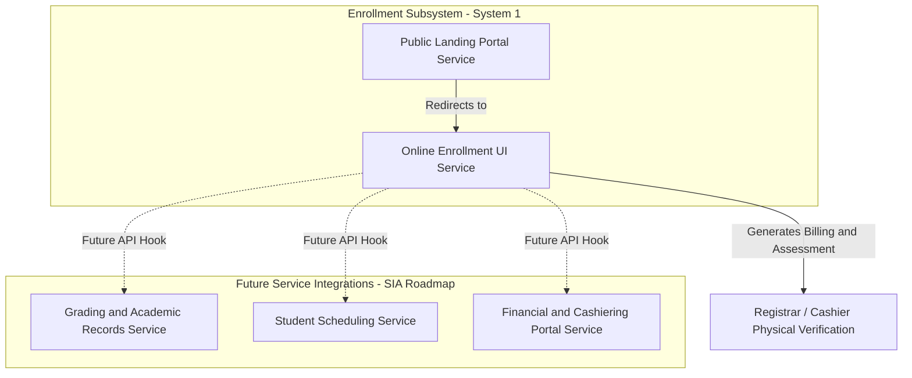

# 🏛️ System Integration and Architecture (SIA) — Multi-Service Enterprise Platform

Welcome to the **System Integration & Architecture (SIA)** enterprise repository. This project is engineered to demonstrate service-oriented architectural patterns, clean separation of concerns, and scalable multi-system integrations for modern educational management software.

---

## 📐 Enterprise Architectural Blueprint



---

## 📂 Repository Structure

The workspace is structured into decoupled, modular service domains to support independent deployment and horizontal scaling:

```
systemforsia/
├── 📄 README.md                 # Main Repository Architectural Overview & Documentation
├── 📘 PROJECT_GUIDE.md          # Complete Developer Guide & Integration Playbook
├── 📂 demo/                     # Sandbox / Prototype Backend & Frontend Service
├── 📂 school-website/           # System #1a: GNCP Public College Landing Portal (CSR)
│   ├── 📄 index.html            # Public College Landing Portal
│   └── 📂 assets/               # Shared Assets (CSS Tokens, WebP Images, MVC Scripts)
├── 📂 enrollment-system/        # System #1b: Decoupled Enrollment UI Service
│   ├── 📄 index.html            # 5-Step Reactive Registration Wizard & Fee Assessor
│   └── 📂 assets/               # Subservice Localized Stylesheets & Logic Drivers
└── 📂 registrar/                # System #2: Registrar Record Management Service
    ├── 📄 index.html            # Registrar Dashboard & Operational Console
    └── 📂 assets/               # Localized CSS, Views, Models, and Controllers
```

---

## 🌟 Key Subsystems & Services

### 1. 🏛️ College Public Portal (`/school-website/`)
- **Institution:** Go-on National College of the Philippines (GNCP) — Dasmariñas, Cavite Campus.
- **Scope:** Dedicated exclusively to undergraduate degree programs (College of IT, College of Business Administration, College of Teacher Education).
- **Architecture:** Clean MVC pattern using Vue 3 reactive states, smooth cross-fade slide carousels, and SVG wave layout dividers.

### 2. 📝 Independent Enrollment UI Service (`/enrollment-system/`)
- **Design Pattern:** Decoupled Single-Page Application (SPA) Wizard architecture.
- **5-Step Reactive Workflow:**
  1. **Program Selection:** Major degree filtering and student admission type classification.
  2. **Personal Information:** Demographic and primary contact details with dynamic input formatting.
  3. **Academic History:** Prior school transcripts and GPA validation.
  4. **Tuition & Assessment Calculator:** Real-time billing computation (21 units @ ₱1,200/unit, lab fees, cash/scholarship discounts, installment terms).
  5. **Review & Printable Assessment Statement:** Detailed billing receipt coupled with official Philippine college admission requirements.

### 3. 🏛️ Registrar Record Management Service (`/registrar/`)
- **Design Pattern:** Modular Vue 3 MVC Component architecture.
- **Scope:** Managing active courses, student records, scheduling sections, enrollment summaries, and application validation.
- **Shared DB Sync:** Automatically reads submitted applications from the enrollment subsystem and seamlessly registers permanent profiles upon registrar approval.

---

## 🛠️ Tech Stack & Standards

- **Frontend Core:** HTML5, CSS3, JavaScript (ES6+ Vanilla & Vue 3 via CDN for protocol compatibility).
- **UI Framework:** Bootstrap 5.3, FontAwesome 6.4, Custom CSS Variables (GNCP Deep Green `#006A4E` & Gold `#D4AF37`).
- **Media Optimization:** Next-gen WebP compression (under 250KB per HD asset for instantaneous page loads).
- **Separation of Concerns:** Zero cross-service coupling; prepared for microservices REST/GraphQL API consumption.

---

## 🚀 Getting Started

### Clone the repository (first time)

```powershell
git clone https://github.com/isanthetroller/systemforsia.git
cd systemforsia
```

### Pull latest changes (already cloned)

```powershell
cd systemforsia
git pull origin main
```

### Open in VS Code

```powershell
cd systemforsia
code .
```

### Open in Antigravity IDE

```powershell
cd systemforsia
antigravity .
```
