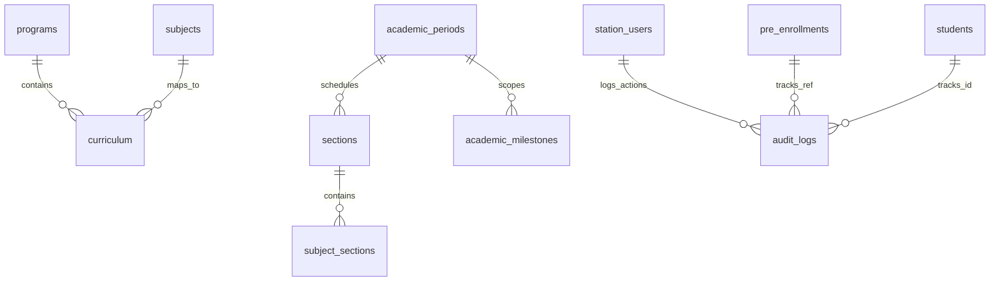
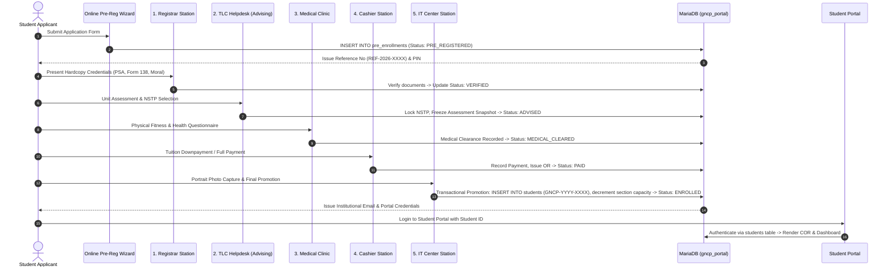
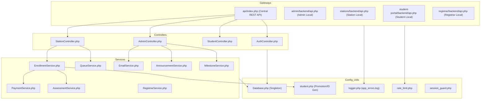

# Comprehensive Codebase & Architecture Audit Report
**System:** Go-on National College of the Philippines (GNCP) Academic & Enrollment Management System  
**Audit Date:** August 16, 2026  
**Environment:** PHP 8.2.12 | MariaDB 10.x (`gncp_portal`) | Vue 3 Progressive CDN | Apache / XAMPP  
**Target Codebase:** `c:\xampp\htdocs\systemtest`

---

## Executive Summary

The GNCP Academic & Enrollment System is a multi-portal educational management ecosystem designed to handle the complete student lifecycle: from public online pre-registration and document tracking, through physical on-campus clearance workstations (Registrar, Academic Advising/Helpdesk, Medical Clinic, Cashier, IT Center), to permanent student portal access, administrative academic catalog management, cohort scheduling, and campus bulletins.

```
┌──────────────────────────────────────────────────────────────────────────────────────────────────┐
│                                   GNCP SYSTEM HIGH-LEVEL TOPOLOGY                                │
├─────────────────────────┬───────────────────────────────┬────────────────────────────────────────┤
│     PUBLIC APPLICANT    │     STAFF & WORKSTATIONS      │          ADMIN & DIRECTORY             │
├─────────────────────────┼───────────────────────────────┼────────────────────────────────────────┤
│ • Online Pre-Reg Wizard │ • Registrar Verification      │ • Super Admin Portal                   │
│ • Real-time Roadmap     │ • TLC Helpdesk & Advising     │ • Curriculum & Term Manager            │
│   Status Tracker        │ • Medical / Clinic Screening  │ • User / Operator Provisioning         │
│ • School Public Website │ • Cashier & OR Billing Desk   │ • Announcements & Milestones           │
│ • Student SAS Portal    │ • IT Center Account Promotion │ • MariaDB Dual-Table Storage           │
└─────────────────────────┴───────────────────────────────┴────────────────────────────────────────┘
```

---

## Part 1 — Frontend Architecture Report

### 1.1 Structural Layout & Portal Modules
The frontend is constructed using a **progressive enhancement architecture** leveraging **Vue 3 (CDN global build)**, vanilla ECMAScript modules, shared styling tokens, and reusable component widgets without requiring a Node.js compilation build step.

```
c:\xampp\htdocs\systemtest\
├── index.html                           # Employee & Admin Central Login Gateway
├── admin\index.html                     # Super Admin Master Management Portal
├── registrar\index.html                 # Registrar Verification & Cohort Allocation
├── student-portal\
│   ├── login.html                       # Student SAS Portal Authentication
│   └── index.html                       # Student Academic Dashboard & COR Viewer
├── enrollment-system\
│   ├── index.html                       # Public Pre-Enrollment Multi-Step Wizard
│   └── tracker.html                     # Real-Time Reference & PIN Application Tracker
├── stations\
│   ├── tlc-helpdesk\index.html          # TLC Academic Advising & NSTP Lock-in Station
│   ├── medical-checkup\index.html       # Clinic Health Screening & Fitness Clearance
│   ├── payment-processing\index.html    # Cashier Billing, Assessment & OR Issuance
│   └── it-center\index.html             # IT Account Promotion & Photo Portrait Capture
├── school-website\index.html            # Public Institutional Landing Page
└── shared\
    ├── profile.html                     # Universal Operator / Admin Profile Editor
    ├── js\
    │   ├── PasswordChangeGuard.js       # Temporary Password Interceptor
    │   └── components\
    │       └── EmployeeSidebar.js       # Shared Navigation & Workstation Sidebar Component
    └── css\
        ├── admin_workstation_theme.css  # Global Design Tokens & Theme Variables
        └── sidebar.css                  # Unified Responsive Sidebar Styles
```

### 1.2 UI Flow by Subsystem

| Portal / View | Primary Purpose | User Trigger / Actions | Reactive State Properties | Dependent Components |
|---|---|---|---|---|
| **Employee Gateway** (`index.html`) | Single entry-point login for all staff & admins | Role-based credential verification, password validation | `isLoggingIn`, `loginError`, `showOperatorPassword` | `PasswordChangeGuard.js`, SweetAlert2 |
| **Super Admin** (`admin/index.html`) | University-wide catalog, terms, users, announcements | CRUD programs, subjects, curriculum, terms, sections, users, announcements, milestones | `programs`, `subjects`, `curriculum`, `periods`, `sections`, `users`, `announcements`, `milestones`, `stats` | `EmployeeSidebar.js`, `AdminSidebar` |
| **Registrar Station** (`registrar/index.html`) | Review pending applicant submissions | Document requirement check, status approvals/rejections, cohort sectioning | `pendingApplications`, `activeTab`, `filterStatus`, `searchQuery`, `selectedApp` | `EmployeeSidebar.js`, `RegistrarModel`, `RegistrarApiService` |
| **TLC Helpdesk** (`stations/tlc-helpdesk/index.html`) | Advising, unit evaluation & NSTP lock-in | Evaluate course units, lock NSTP component, apply scholarship vouchers | `queue`, `selectedStudent`, `activeFilter`, `searchQuery`, `scholarshipType` | `EmployeeSidebar.js`, `StationDataBus.js` |
| **Medical Clinic** (`stations/medical-checkup/index.html`) | Health assessment & physical fitness exam | Review medical history, record vitals, mark `FIT` / `CONDITIONAL` / `UNFIT` | `queue`, `selectedStudent`, `medicalForm`, `healthFilter` | `EmployeeSidebar.js`, `StationDataBus.js` |
| **Cashier Station** (`stations/payment-processing/index.html`) | Tuition payment collection & OR generation | Verify assessment snapshot, record cash/installment payments, issue OR number, print COR | `queue`, `selectedStudent`, `paymentForm`, `assessmentSnapshot`, `orNumber` | `EmployeeSidebar.js`, `StationDataBus.js`, `cor_print.php`, `receipt_print.php` |
| **IT Center Station** (`stations/it-center/index.html`) | Final enrollment promotion & ID provisioning | Capture webcam portrait, promote applicant to permanent student, generate ID & institutional email | `queue`, `selectedStudent`, `capturedPhoto`, `generatedStudentId`, `isEnrolling` | `EmployeeSidebar.js`, `StationDataBus.js` |
| **Pre-Reg Wizard** (`enrollment-system/index.html`) | Public applicant enrollment registration | Multi-step form (Personal, Academic, Medical, Payment, Review), submit application | `currentStep`, `formData`, `programs`, `activePeriod`, `isSubmitting` | SweetAlert2, `academic_constants.js` |
| **Status Tracker** (`enrollment-system/tracker.html`) | Track admission status with Ref No & PIN | Input Ref No + PIN, view live 7-step roadmap progress and station clearances | `refNumber`, `pin`, `studentData`, `roadmapSteps`, `isLoading` | SweetAlert2 |
| **Student Portal** (`student-portal/index.html`) | Enrolled student academic hub | View COR, weekly class schedule, financial ledger, announcements, academic milestones | `student`, `enrollmentData`, `advisedSubjects`, `announcements`, `milestones`, `assessment` | SweetAlert2, `StudentApiService.js` |

### 1.3 Design System & Shared Token Hierarchy
All workstations and portals inherit tokens defined in `shared/css/admin_workstation_theme.css`:
- **Institutional Color Tokens:**
  - Primary Forest Green: `#006A4E` (`--primary-green`)
  - Deep Botanical Green: `#003D2B` (`--dark-green`)
  - Emerald Accent: `#3E9B6C` (`--accent-green`)
  - Mint Surface Tint: `#e6f4ed` (`--light-accent-green`)
  - Academic Gold: `#D4AF37` / `#FCD34D` (`--gold`, `--gold-light`)
- **Typography & Font Stacks:**
  - Modern Headings: `'Outfit', sans-serif`
  - High-Legibility Body: `'Open Sans', -apple-system, BlinkMacSystemFont, sans-serif`
  - Technical / IDs / Keys: `'Courier New', Courier, monospace`
- **Dynamic Theme Inheritance Invariant:**
  - Workstation sidebars consume `background: var(--sidebar-bg);` ensuring dark slate/green gradient consistency across all station portals.

---

## Part 2 — Backend Architecture & Service Layer Report

### 2.1 Backend Class & Service Hierarchy

```
c:\xampp\htdocs\systemtest\
├── api\
│   ├── index.php                         # Central REST API Engine & Gateway
│   ├── controllers\
│   │   ├── AuthController.php            # Session, Login, Logout, Passwords, Profiles, Avatars
│   │   ├── StationController.php         # Workstation Queue Polling & Atomic Updates
│   │   ├── StudentController.php         # Pre-Registration, Tracker Lookup, Test Purging
│   │   ├── AdminController.php           # Master Admin Aggregator Controller
│   │   ├── UserAdminController.php       # Operator CRUD & Email Dispatch
│   │   ├── CatalogAdminController.php    # Academic Programs & Subjects Catalog
│   │   └── ScheduleAdminController.php   # Sections, Terms & Block Allocation
│   └── models\
│       ├── UserModel.php                 # Queries station_users, students & pre_enrollments
│       ├── StudentModel.php              # Dual-table operations (pre_enrollments & students)
│       ├── SectionModel.php              # Section cohorts & subject section queries
│       └── CourseModel.php               # Program & Subject data abstractions
├── shared\backend\
│   ├── config\
│   │   ├── database.php                  # Database Singleton (Database::getInstance())
│   │   └── mail.php                      # SMTP Server & Port Configuration
│   ├── services\
│   │   ├── AssessmentService.php         # Authoritative Tuition & Fee Assessment Engine
│   │   ├── EmailService.php              # Native Socket SMTP Dispatch (Ports 587/465)
│   │   ├── AnnouncementService.php       # Admin Campus Bulletins & File Attachments
│   │   ├── MilestoneService.php          # Academic Calendar Deadlines & Events
│   │   ├── RegistrarService.php          # Application Approvals & Roadmap Updates
│   │   ├── SectionService.php            # Block Cohort Sectioning Queries
│   │   ├── CatalogService.php            # Program, Subject & Curriculum Lookups
│   │   └── BaseStationService.php        # Base Service abstractions
│   └── utils\
│       ├── logger.php                    # Centralized File Logging (app_errors.log)
│       ├── rate_limit.php                # IP-based Rate Limiter (5 regs/min, 20 tracks/min)
│       ├── response.php                  # JSON API Response Formatter (sendResponse)
│       ├── session_guard.php             # Role-based Session Authentication Guard
│       └── student.php                   # Collision-Free ID Generation & Student Promotion
└── stations\backend\services\
    ├── QueueService.php                  # Dual-Table Queue Compilation & ETag Hash Engine
    ├── EnrollmentService.php             # ACID Transactional Mutations & IT Promotion
    └── PaymentService.php                # Cashier Payment Rules & Invariant Validation
```

### 2.2 Core Service Responsibilities & Process Breakdown

#### `AssessmentService.php` (Financial Engine)
- **Mathematical Invariants:**
  $$\text{Cash Total} = (\text{Total Units} \times \text{Tuition Rate}) + \text{Lab Fees} + \text{Misc Fees} + \text{LMS} + \text{OMR} + \text{NSTP Fee} - \text{Discounts}$$
  $$\text{Installment Total} = \text{Cash Total} \times 1.08 \quad (\text{8\% Surcharge})$$
- **Pre-Payment Snapshot Freezing:** When a student is advised at TLC Helpdesk, `AssessmentService::calculateAssessment` freezes an immutable snapshot inside `pre_enrollments.payment_data.assessmentSnapshot`. Subsequent adjustments to global fee schedules do not distort the student's locked tuition rate.
- **Multi-Payment Ledger & Voiding Protection:** Iterates over the `payments` array, filters out records with status `VOIDED` or `CANCELLED`, sums valid transactions, and computes exact remaining balance.

#### `EnrollmentService.php` (Atomic Lifecycle Transitions)
- **ACID Transaction Enclosure:**
  ```php
  $pdo->beginTransaction();
  try {
      // 1. Update pre_enrollments state & roadmap JSON
      // 2. Mirror updates to students table if promoted
      // 3. Promote applicant upon IT Center activation (generate ID, email, hash password)
      // 4. Decrement subject section capacities: capacity = GREATEST(0, capacity - 1)
      // 5. Append structured entry to audit_logs table
      $pdo->commit();
  } catch (Exception $e) {
      $pdo->rollBack();
      throw $e;
  }
  ```
- **Sequential Roadmap Step Validation:** Prevents out-of-order clearance (e.g. attempting cashier payment before registrar verification or advising).

#### `QueueService.php` (High-Efficiency Dual-Table Queue Aggregator)
- **High-Speed Checksum Engine (`getQueueHash`):** Computes CRC32 checksums across `pre_enrollments` and `students` to emit HTTP `ETag` headers, enabling `304 Not Modified` responses for polling clients when no state changes occur.
- **Dual-Table Merging:** Pre-loads programs and curriculum maps into associative caches in ~7 SQL queries total, completely eliminating N+1 query loops.

#### `EmailService.php` (Native Socket SMTP Engine)
- **Dual-Port Automatic Fallback:** Uses low-level PHP socket streams (`stream_socket_client`) with `STARTTLS` on Port 587 and fallback to direct `ssl://` on Port 465, eliminating heavy external dependencies like PHPMailer while preserving zero-downtime credentials delivery.

---

## Part 3 — Frontend ↔ Backend Connectivity & Event Synchronization

### 3.1 End-to-End Communication Cycle

```
┌────────────────────────────────────────────────────────────────────────────────────────┐
│                        ZERO-PAGE-REFRESH DATA SYNCHRONIZATION                          │
└────────────────────────────────────────────────────────────────────────────────────────┘

 [ Workstation UI (Vue 3) ]
            │
            │  1. User triggers action (e.g. Verify Documents / Mark Paid)
            ▼
 [ Local Reactive State Update ] ──► Instant visual feedback on current screen
            │
            │  2. StationDataBus.sendUpdateToBackend(refNo, deltaKeys)
            ▼
 [ POST /api/index.php?action=stations/update ] (With X-Request-ID Header)
            │
            │  3. api/index.php routes to StationController -> EnrollmentService
            ▼
 [ MariaDB 10.x Database ] ──► ACID Transaction: updates pre_enrollments / students / audit_logs
            │
            │  4. HTTP 200 JSON Success Payload returned
            ▼
 [ StationDataBus Background Poller ] (3-5s interval, ETag validated)
            │
            │  5. Detects hash delta, updates localStorage: 'gncp_enrollment_queue'
            ▼
 [ window.dispatchEvent('storage') ] ──► Triggers instant re-render across ALL open browser tabs
```

### 3.2 Key API Endpoint Connectivity Matrix

| Operation / Feature | Frontend Source | HTTP Method & Gateway Route | Backend Handler | Database Mutation |
|---|---|---|---|---|
| **Employee Login** | `index.html` | `POST /api/index.php?action=auth/login` | `AuthController::login` | Reads `station_users`, sets `$_SESSION` |
| **Queue Polling** | `StationDataBus.js` | `GET /api/index.php?action=stations/queue` | `QueueService::fetchQueue` | Reads `pre_enrollments` + `students` (ETag 304) |
| **Station Updates** | All Workstations | `POST /api/index.php?action=stations/update` | `EnrollmentService::updateStudent` | Atomic `pre_enrollments`, `students`, `audit_logs` |
| **Student Pre-Reg** | `enrollment-system` | `POST /api/index.php?action=student/register` | `StudentController::register` | `INSERT INTO pre_enrollments` |
| **Track Status** | `tracker.html` | `GET /api/index.php?action=student/track` | `StudentController::track` | Reads `pre_enrollments` or `students` |
| **Admin Catalog** | `admin/index.html` | `GET /api/index.php?action=admin/catalog` | `CatalogAdminController::getCatalog` | Reads `programs`, `subjects`, `curriculum` |
| **Save Program** | `admin/index.html` | `POST /api/index.php?action=admin/save_program` | `CatalogAdminController::saveProgram` | `INSERT / UPDATE programs` |
| **Save Section** | `admin/index.html` | `POST /api/index.php?action=admin/save_section` | `ScheduleAdminController::saveSection`| `INSERT / UPDATE sections` |
| **Save User** | `admin/index.html` | `POST /api/index.php?action=admin/save_user` | `UserAdminController::saveUser` | `INSERT INTO station_users`, dispatches email |
| **Announcements** | Admin / Student | `GET /api/index.php?action=announcements/list` | `AnnouncementService::getAnnouncements`| Reads `announcements` |
| **Milestones** | Admin / Student | `GET /api/index.php?action=milestones/list` | `MilestoneService::getMilestones` | Reads `academic_milestones` |

---

## Part 4 — Database Architecture & Schema Specification

The `gncp_portal` database contains **16 InnoDB tables** engineered with relational indexes and integrity guards:



### 4.1 Comprehensive Table Map

| Table Name | Storage Engine | Record Purpose & Lifecycle Role | Primary Key | Foreign / Lookup Keys & Indexes |
|---|---|---|---|---|
| `pre_enrollments` | `InnoDB` | Active applicant staging queue across all stations | `id` (INT Auto) | `temp_student_id` (Unique), `status`, `email`, `course_code` |
| `students` | `InnoDB` | Permanent official student directory (post-promotion) | `id` (VARCHAR) | `temp_reference_no`, `email`, `program`, `status` |
| `station_users` | `InnoDB` | Administrative and workstation operator staff accounts | `id` (INT Auto) | `username` (Unique), `role`, `status` |
| `programs` | `InnoDB` | Degree programs (BSCS, BSIT, BSCpE, BSN, BSBA) | `id` (INT Auto) | `code` (Unique), `department`, `status` |
| `subjects` | `InnoDB` | Subject catalog with lecture/lab units, fees & prereqs | `id` (INT Auto) | `code` (Unique), `department`, `title` |
| `curriculum` | `InnoDB` | Program-to-subject matrix by year level and semester | `id` (INT Auto) | `program`, `year_level`, `semester`, `curriculum_version` |
| `academic_periods`| `InnoDB` | Academic years & semesters (e.g. 1st Sem 2026-2027) | `id` (INT Auto) | `status`, `academic_year`, `semester` |
| `sections` | `InnoDB` | Cohort sections (Section A, Section B) per period | `id` (INT Auto) | `unique_section_cohort` (`code`, `program`, `year`, `period`) |
| `subject_sections`| `InnoDB` | Individual class schedules (days, time, room, capacity)| `id` (INT Auto) | `code` (Unique), `section_id`, `capacity` |
| `fee_schedule` | `InnoDB` | Authoritative institutional fee rates and per-unit costs | `id` (INT Auto) | `type`, `label`, `per_unit` |
| `departments` | `InnoDB` | College academic and support departments | `id` (INT Auto) | `code` (Unique), `status` |
| `audit_logs` | `InnoDB` | Immutable forensic log of all workstation mutations | `id` (INT Auto) | `reference_number`, `operator_username`, `created_at` |
| `password_resets` | `InnoDB` | Time-limited student password reset tokens and PINs | `id` (INT Auto) | `email`, `token`, `code`, `expires_at` |
| `announcements` | `InnoDB` | Admin-published campus bulletins and advisories | `id` (INT Auto) | `status`, `is_pinned`, `category`, `created_at` |
| `academic_milestones`| `InnoDB`| Calendar milestones (Examinations, Encodings, Deadlines)| `id` (INT Auto) | `academic_period_id`, `status`, `display_order` |
| `enrollments` | `InnoDB` | Historical legacy snapshot archive (read-only) | `id` (INT Auto) | `student`, `course`, `status` |

---

## Part 5 — Detailed Multi-Station Sequential Pipeline



---

## Part 6 — System Dependency & File Coupling Map



---

## Part 7 — Codebase Onboarding Guide for Developers & AI Agents

To inspect, debug, or extend this repository efficiently, follow this step-by-step roadmap:

1. **Database Baseline:** Open `database/schema.sql`. Note the two primary student tables: `pre_enrollments` (staging queue for unpromoted applicants) and `students` (official directory for enrolled accounts).
2. **Database Driver:** Check `shared/backend/config/database.php`. Always consume `Database::getInstance()` to obtain the unified PDO instance.
3. **API Routing:** Begin tracing at `api/index.php`. All standard REST requests route through `$routes` array to `api/controllers/*`.
4. **Financial Invariants:** For any billing, tuition rate, lab fee, or balance inquiry, inspect `shared/backend/services/AssessmentService.php`.
5. **Workstation Data Sync:** Inspect `stations/assets/js/DataBus.js`. All workstation frontends receive real-time queue sync via background polling against `/api/index.php?action=stations/queue`.
6. **Authentication & Roles:** Check `api/controllers/AuthController.php` and `shared/backend/login.php`. Roles include `SUPER_ADMIN`, `ADMIN`, `REGISTRAR`, `HELPDESK`, `MEDICAL`, `CASHIER`, and `IT_CENTER`.
7. **End-to-End Testing:** Run automated regression suites located in `tests/test_financial_system.php` and `tests/selenium/test_runner.py`.
