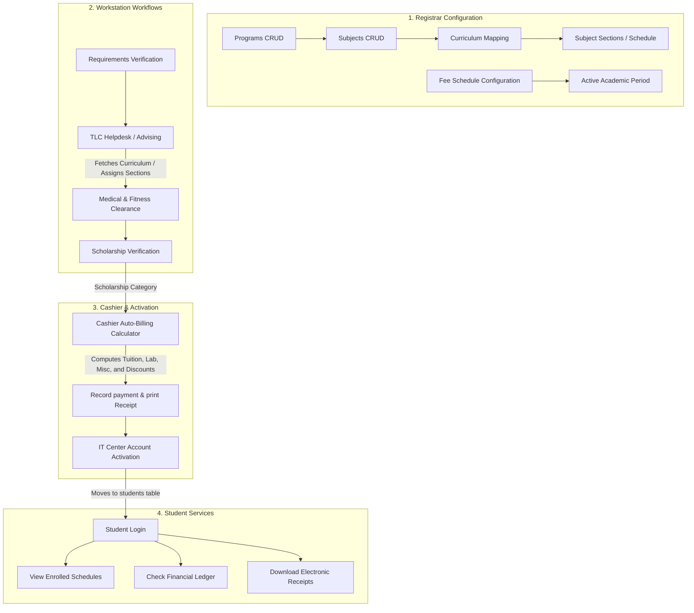

# Course & Subject Management with Payment Integration

This document outlines the technical design, database changes, business rules, and integration flows for the course/subject catalog and automated billing system.

---

## 1. Architectural Overview

The upgraded architecture transitions the Go-on National College of the Philippines (GNCP) enrollment system from static, unlinked tables to a fully integrated course catalog, scheduling, automated assessment, and student tracking system.

---

## 2. Database Schema Reference

The system introduces 8 new tables to support the academic and financial components. The legacy `courses` table is renamed to `programs` to align with academic naming conventions.

### Table Relationships (Entity Relationship Summary)

*   `programs` (PK: `code`): Degree programs (e.g. `BSIT`, `BSCS`).
*   `subjects` (PK: `code`): Master academic subject repository. Lab fees and units are specified here.
*   `curriculum_subjects` (Composite PK: `program`, `subject`, `year_level`, `semester`): Maps which subjects belong to a program's path.
*   `academic_periods` (PK: `id`, status is unique 'Active'): Tracks school semesters and enrollment windows.
*   `subject_sections` (PK: `id`, unique combination of `subject`, `code`, `period`): Specific section offerings.
*   `student_enrollments` (Composite PK: `student_id`, `section_id`): Enrolled schedules per student.
*   `fee_schedule` (PK: `id`): Configuration table for tuition rates and flat fees.
*   `billing_ledgers` (PK: `id`): Semester balance sheets with discount calculations.
*   `payment_transactions` (PK: `id`): Ledger audits mapping receipts to cash inflows.

---

## 3. Business & Computation Logic

### 3.1 Course Registration & Advising (TLC Helpdesk)
*   **Advising Rules**:
    1.  Recommended subjects are loaded based on the student's program and year level.
    2.  For elective subjects, advisors must map compatible available offerings.
    3.  If a subject has prerequisites, the system cross-references previous grade tables (or assumes verification if bypasses are explicitly overridden).
    4.  Section capacities are strictly validated; once a section's maximum cap is reached, it will reject additional allocations.

### 3.2 Automated Billing Calculator
Upon arriving at the Cashier Station, the system queries the advisor's locked subjects list (`enrollment_data` JSON) and the active `fee_schedule` rates.

The net student assessment is calculated as follows:

1.  **Tuition Fee**:
    $$\text{Tuition Fee} = \text{Total Enrolled Units} \times \text{Tuition Rate per Unit}$$
2.  **Lab Fees**:
    $$\text{Lab Fees} = \sum (\text{Enrolled Subject Lab Fees})$$
3.  **Miscellaneous Fees**:
    $$\text{Miscellaneous Fees} = \sum (\text{Misc, Library, Athletic, Registration Flat Rates})$$
4.  **Gross Semester Total**:
    $$\text{Gross Total} = \text{Tuition} + \text{Lab} + \text{Miscellaneous}$$
5.  **Scholarship Discount Application**:
    *   `HONOR` (Academic Scholar): 100% discount on Tuition fee.
    *   `ATHLETIC`: 50% discount on Tuition fee.
    *   `FINANCIAL`: 100% discount on Miscellaneous fees.
    *   `NONE`: 0% discount.
6.  **Net Assessment**:
    $$\text{Net Assessment} = \text{Gross Total} - \text{Applied Discount}$$

---

## 4. End-to-End E2E Testing Validation

Verification of the complete enrollment, advising, medical, scholarship, billing, receipt generation, IT promotion, and student portal schedules viewing is covered under the integration test suite located at [test_ui.html](file:///c:/Users/ethan/Downloads/systemforsia/test_ui.html).
