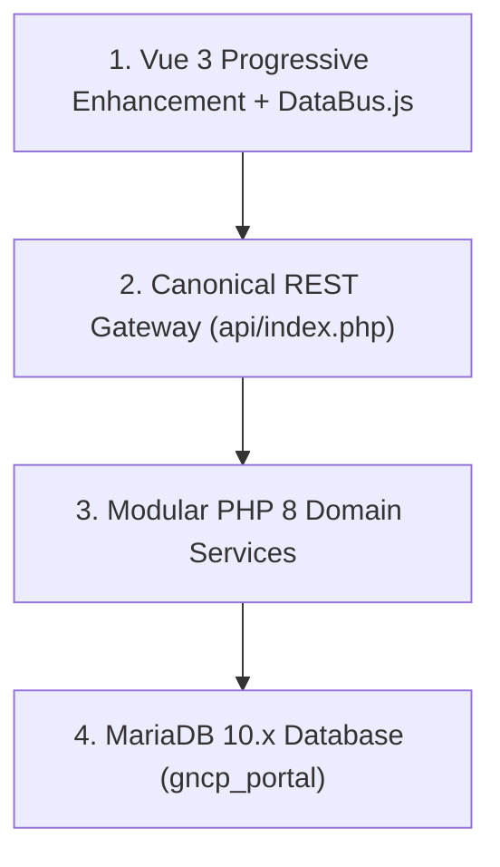

# 📐 System Architecture & Topology

> [!info]
> Linked to the master hub: [[SYSTEM_KNOWLEDGE_BASE|Master Knowledge Base]]

## Multi-Layer Architecture

* **Client Layer**: Vue 3 Progressive Enhancement via CDN. Event sync driven by [[Station_System|Station Workstations]] and `DataBus.js`.
* **API Gateway**: Canonical router at `api/index.php`. Enforces [[Security_Audit|Session Guards]] and rate limits. See [[API_Map|API Route Inventory]].
* **Domain Services**: Pure business logic services including `AssessmentService.php`, `QueueService.php`, and `EnrollmentService.php`.
* **Persistence Layer**: MariaDB InnoDB tables detailed in [[Database_Schema|Database Schema]].

## Related Notes
* [[Database_Schema|Database Schema & Relationships]]
* [[API_Map|API Endpoint Catalog]]
* [[Student_Workflow|Student Lifecycle State Machine]]
* [[Business_Rules|System Business Rules]]
