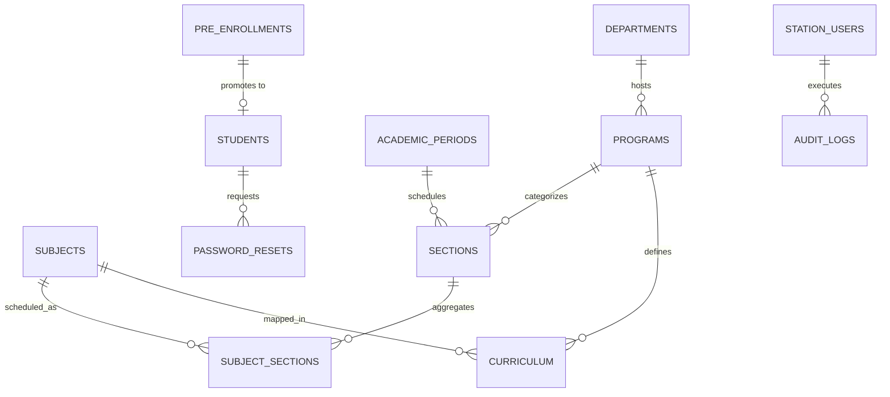

# 🗄️ Database Schema & Entity Relationships

> [!info]
> Linked to the master hub: [[SYSTEM_KNOWLEDGE_BASE|Master Knowledge Base]]

## Entity Relationship Overview

## Core Tables
1. **`pre_enrollments`**: Staging applicant queue. Mapped in [[Student_Workflow|Student Workflow]].
2. **`students`**: Permanent official student directory populated by the IT Center during [[Station_System|Station Processing]].
3. **`programs`**, **`subjects`**, **`curriculum`**: Handled via [[Curriculum_System|Curriculum System]].
4. **`sections`**, **`subject_sections`**: Managed in [[Curriculum_System|Sectioning & Offerings]].
5. **`station_users`**: User roles and accounts detailed in [[Roles_and_Permissions|Roles and Permissions]].

## Related Notes
* [[Architecture|Architecture Overview]]
* [[Curriculum_System|Curriculum Mechanics]]
* [[Student_Workflow|Student Lifecycle]]
* [[Dangerous_Areas|Dangerous Database Operations]]
