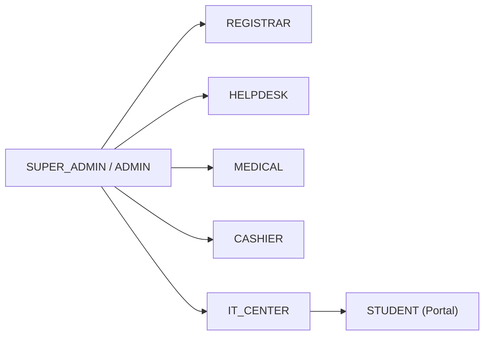

# 🔐 Roles & Permissions Architecture

> [!info]
> Linked to the master hub: [[SYSTEM_KNOWLEDGE_BASE|Master Knowledge Base]]

## Role Hierarchy

## Matrix Summary
* **`SUPER_ADMIN`**: Full platform control. Managed via Super Admin Portal.
* **`REGISTRAR`**: Document review and applicant admission. See [[Station_System|Registrar Desk]].
* **`HELPDESK`**: Advising and sectioning. See [[Curriculum_System|Curriculum System]].
* **`MEDICAL`**: Medical exams and clinical clearance.
* **`CASHIER`**: Tuition payment and OR issuance. See [[Business_Rules|RULE-002]].
* **`IT_CENTER`**: Student account promotion and ID provisioning.
* **`STUDENT`**: Self-service portal access for enrolled students. See [[Authentication|Student Authentication]].

## Related Notes
* [[Authentication|Authentication & Session Guards]]
* [[Station_System|Workstation Portals]]
* [[Security_Audit|Security Review]]
