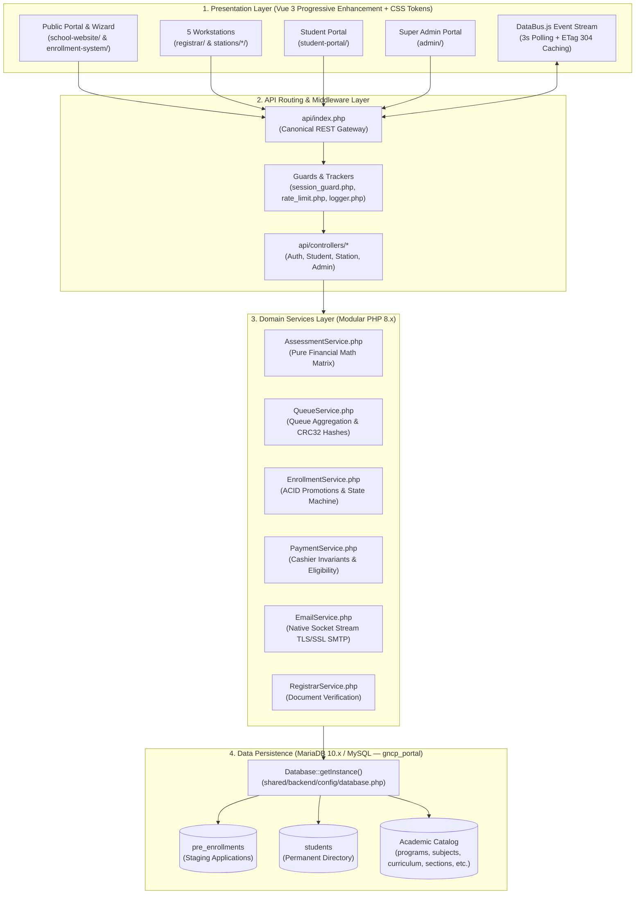
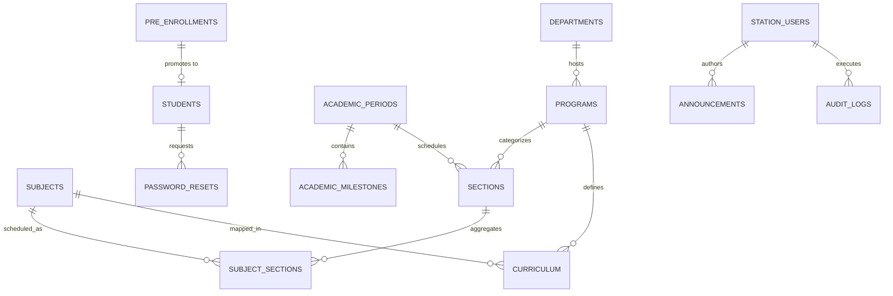
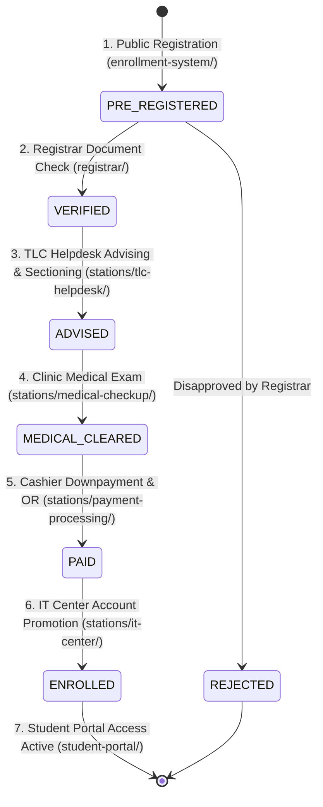

# 🏛️ GNCP Academic & Enrollment System — Canonical Knowledge Base

> [!abstract] Executive Overview
> This document serves as the **persistent canonical technical knowledge base** for the **GNCP Academic, Admissions & Workstation Enrollment System (`systemtest`)**. It is formatted in **Obsidian Flavored Markdown (OFM)** for full compatibility with Obsidian graph views, wikilinks, callouts, block references, and property inspectors.

> [!danger]+ Critical Directive for Future AI & Developers
> Before inspecting or modifying any application code, read [[#26. AI Context — Read Before Modifying the System|Section 26: AI Context Summary]]. Never assume system behavior without cross-referencing this document. ^ai-warning

---

## 📑 Knowledge Graph Hub (Obsidian Modular Vault Links)

* [[#1. System Overview|1. System Overview]]
* [[Architecture|2. Architecture Topology]]
* [[#3. Technology Stack Matrix|3. Technology Stack Matrix]]
* [[#4. Project Structure Map|4. Project Structure Map]]
* [[#5. Core Domain Model|5. Core Domain Model]]
* [[#6. Academic Hierarchy & Relationships|6. Academic Hierarchy & Relationships]]
* [[Curriculum_System|7. Curriculum System Mechanics]]
* [[#8. Enrollment & Sectioning Engine|8. Enrollment & Sectioning Engine]]
* [[Student_Workflow|9. Student Lifecycle State Machine]]
* [[Station_System|10. Station Subsystem Matrix]]
* [[Roles_and_Permissions|11. Roles & Permissions Architecture]]
* [[Authentication|12. Authentication & Account Management]]
* [[API_Map|13. Canonical API Route Inventory]]
* [[Database_Schema|14. Database Schema & Entity Map]]
* [[#15. Single Source of Truth Analysis|15. Single Source of Truth Analysis]]
* [[Business_Rules|16. Enforced Business Rules]]
* [[#17. Known Issues & Bugs|17. Known Issues & Bugs]]
* [[#18. Architectural Deficits|18. Architectural Deficits]]
* [[Security_Audit|19. Security Review & Vulnerability Audit]]
* [[Testing_Coverage|20. Testing Matrix & Coverage Gaps]]
* [[Dangerous_Areas|21. ⚠️ Dangerous Areas to Modify]]
* [[Development_Rules|22. Mandatory Development Rules]]
* [[#23. Current System Limitations|23. Current System Limitations]]
* [[#24. Prioritized Engineering Roadmap|24. Prioritized Engineering Roadmap]]
* [[#25. Architecture Quality Critique Summary|25. Architecture Quality Critique Summary]]
* [[#26. AI Context — Read Before Modifying the System|26. AI Context (Quick-Reference Briefing)]]
* [[#24. Prioritized Engineering Roadmap|24. Prioritized Engineering Roadmap]]
* [[#25. Architecture Quality Critique Summary|25. Architecture Quality Critique Summary]]
* [[#26. AI Context — Read Before Modifying the System|26. AI Context (Quick-Reference Briefing)]]

---

# 1. System Overview

* **System Name**: Go-on National College of the Philippines (GNCP) Academic, Admissions & Workstation Enrollment System (`systemtest`).
* **Purpose**: Manages the end-to-end undergraduate student lifecycle across 5 distinct physical workstations, an authenticated student portal, a public application wizard, and a centralized Super Admin control center.
* **Target Users**: Prospective freshmen/transferees, returning students, workstation operators (Registrar, Helpdesk, Medical Doctor, Cashier, IT Center), and Super Administrators.
* **Core Value Proposition**:
  * ==Decoupled multi-station state machine== eliminating physical queuing bottlenecks.
  * Real-time zero-page-refresh UI updates via background event polling (`DataBus.js`).
  * 100% deterministic Philippine college fee assessments (tuition per unit, lab fees, NSTP, LMS, OMR, installment 8% charge, scholarships).
  * Automated staging-to-permanent student account promotion.

---

# 2. Architecture Topology



---

# 3. Technology Stack Matrix

| Architectural Tier | Technology / Library | Version / Spec | Engineering Rationale & Implementation Details |
| :--- | :--- | :--- | :--- |
| **Frontend Framework** | **Vue 3** | 3.3.4 (CDN) | Progressive enhancement without Node compilation overhead; mounts directly on `#app`. |
| **Styling Architecture** | **Vanilla CSS + Bootstrap** | Bootstrap 5.3.0 | Custom HSL tokens (`--sidebar-bg`), responsive grid, dark/light theme inheritance. |
| **Event Synchronization**| **`DataBus.js`** | Custom Event Stream | Background 3s interval comparing CRC32 ETag hashes; triggers zero-refresh Vue re-renders. |
| **Backend Engine** | **PHP** | PHP 8.0+ | Strict typed domain services, ACID transactions, and modular controllers. |
| **Database Engine** | **MariaDB / MySQL** | 10.4+ (`InnoDB`) | 16 relational tables with compound B-Tree indexes on `gncp_portal`. |
| **Authentication Engine**| **PHP Sessions + Bcrypt** | `PASSWORD_DEFAULT` | Role-isolated sessions (`gncp_station_user`, `gncp_student`, `gncp_admin_user`). |
| **Mail Dispatch Engine** | **Native Socket Stream** | `stream_socket_client` | Zero external dependencies; automated STARTTLS (587) / SSL (465) fallback. |
| **Automated Testing** | **Selenium + PHPUnit** | Python 3.10+, PHP CLI | Automated 10-step full browser lifecycle + 28-scenario billing matrix. |

---

# 4. Project Structure Map

```text
systemtest/
├── admin/                     # Super Admin Portal (Vue 3 UI & AdminController.js)
│   └── backend/               # admin/backend/api.php + modular sub-scripts (catalog, term, scheduling)
├── api/                       # Canonical REST Gateway
│   ├── controllers/           # AuthController, StudentController, StationController, AdminController
│   └── index.php              # Central Gateway with X-Request-ID, rate limiting, and ETag 304
├── database/                  # Schema DDL & database migrations
│   ├── schema.sql             # 16-table master schema with bootstrap data
│   └── migrations/            # Incremental patches & performance indexing
├── enrollment-system/         # Public Application Wizard & Live Tracker
│   ├── index.html             # 5-step reactive registration wizard
│   ├── tracker.html           # Public application status tracker
│   └── backend/               # register.php, track.php
├── registrar/                 # Registrar Review Workstation
│   ├── index.html             # Document verification & admission review UI
│   └── backend/api.php        # Registrar local API router
├── shared/                    # Shared core assets, backend services, and utilities
│   ├── backend/config/        # database.php (Singleton), mail.php (SMTP settings)
│   ├── backend/services/      # AssessmentService, EmailService, RegistrarService, CatalogService, etc.
│   ├── backend/utils/         # student.php, session_guard.php, rate_limit.php, logger.php, response.php
│   ├── css/                   # admin_workstation_theme.css (Design tokens)
│   └── js/                    # PasswordChangeGuard.js, EmployeeSidebar.js
├── stations/                  # Physical Workstation Portals
│   ├── assets/js/DataBus.js   # Background event stream & queue sync
│   ├── backend/services/      # QueueService.php, EnrollmentService.php, PaymentService.php
│   ├── it-center/             # IT Center Account Promotion Workstation
│   ├── medical-checkup/       # School Clinic Workstation
│   ├── payment-processing/    # Treasury / Cashier Payment Processing Workstation
│   └── tlc-helpdesk/          # Academic Advising & Section Allocation Workstation
├── student-portal/            # Enrolled Student Portal (COR, Schedule, Reset)
│   ├── index.html             # Student dashboard, COR printable receipt, weekly schedule
│   ├── login.html             # Student portal login
│   ├── forgot-password.html   # 6-digit OTP password reset wizard
│   └── backend/api.php        # Student portal API controller
└── tests/                     # Automated Test Suites
    ├── run_tests.js           # Node VM syntax & API contract linter
    ├── test_financial_system.php # 28-scenario billing calculation test matrix
    └── selenium/              # test_runner.py (10-step full lifecycle automated browser suite)
```

---

# 5. Core Domain Model



### Entity Definitions
* **`pre_enrollments`**: Staging applicant records (`temp_student_id: GNCP-2026-XXXXXX`, `temp_pin: 6 digits`, `status: PRE_REGISTERED`).
* **`students`**: Official permanent student directory (`id: GNCP-YYYY-XXXX`, institutional email: `user@gncp.edu.ph`, status: `Active`).
* **`station_users`**: Employee accounts with roles (`SUPER_ADMIN`, `REGISTRAR`, `HELPDESK`, `MEDICAL`, `CASHIER`, `IT_CENTER`).
* **`programs`**: Degree programs (`BSIT`, `BSCS`, `BSCpE`, `BSN`, `BSBA`) mapped to departments.
* **`subjects`**: Course catalog (lecture units, lab units, lab fee, prerequisites, department).
* **`curriculum`**: Program-specific subject mapping per year level, semester, and curriculum version.
* **`sections`**: Cohort block sections (`code: A`, `program`, `year_level`, `academic_period_id`, `capacity: 40`).
* **`subject_sections`**: Specific schedule slots (`code: IT-IT101-A`, `days: MW`, `time: 09:00 AM - 10:30 AM`, `room: Lab 1`).
* **`academic_periods`**: Semestral calendar terms (`academic_year: 2026-2027`, `semester: 1st Semester`, `status: Active`).

---

# 6. Academic Hierarchy & Relationships

### Relational Chain
$$\text{Department} \longrightarrow \text{Program} \longrightarrow \text{Curriculum} \longrightarrow \text{Academic Period} \longrightarrow \text{Year Level} \longrightarrow \text{Semester} \longrightarrow \text{Subject} \longrightarrow \text{Section} \longrightarrow \text{Student}$$

* **Department $\rightarrow$ Program**: Mapped by textual department string in `programs.department`.
* **Program $\rightarrow$ Curriculum**: Matched by program name or code in `curriculum.program`.
* **Year Levels**: String cohorts (`'1st Year'`, `'2nd Year'`, `'3rd Year'`, `'4th Year'`).
* **Semesters**: Term cohorts (`'1st Semester'`, `'2nd Semester'`, `'Summer'`).
* **Subject Resolution**: Evaluated dynamically via `getCurriculumSubjects()` in [`shared/backend/utils/student.php`](file:///c:/xampp/htdocs/systemtest/shared/backend/utils/student.php).

---

# 7. Curriculum System Mechanics

```sql
/* Canonical Curriculum Prospectus Query */
SELECT s.code, s.title, s.lecture_units, s.lab_units, s.lab_fee, s.prerequisites, c.curriculum_version
FROM `curriculum` c
JOIN `subjects` s ON (c.subject = s.title OR c.subject = s.code)
WHERE (c.program = :progName OR c.program = :progCode)
  AND c.year_level = :year AND c.semester = :sem
  AND c.curriculum_version = :ver;
```

> [!important] Price Freeze Invariant
> When TLC Helpdesk advises subjects, an `assessmentSnapshot` is generated and frozen inside `payment_data`. Future modifications to subject tuition rates or lab fees in the Admin Catalog **do not mutate** already-advised student billing statements. ^price-freeze

---

# 8. Enrollment & Sectioning Engine

* **Section Capacity Control**: When IT Center completes promotion, `subject_sections.capacity` is atomically decremented:
  ```sql
  UPDATE `subject_sections` SET `capacity` = GREATEST(0, `capacity` - 1) WHERE `code` = :code;
  ```
* **Returning Students**: Validated via `register.php?action=lookup_returning_student`. If the student is marked `Inactive` or `Re-enrolling`, their academic history is pre-filled and they bypass initial registration checks.

---

# 9. Student Lifecycle State Machine



### State Progression Rules
1. `PRE_REGISTERED`: Initial entry in `pre_enrollments` staging queue.
2. `VERIFIED`: Registrar confirms PSA, Form 138/TOR, and Good Moral certificate.
3. `ADVISED`: TLC Helpdesk locks NSTP component and assigns block section cohort.
4. `MEDICAL_CLEARED`: Medical Doctor logs physical exam vitals and fitness rating.
5. `PAID`: Cashier verifies fee breakdown, records downpayment, and issues OR Number.
6. `ENROLLED / Active`: IT Center transactionally inserts official record into `students` table, generating institutional ID and `@gncp.edu.ph` email.

---

# 10. Station Subsystem Matrix

| Station | Location / Directory | Operator Role | Target Status | Invariant / Business Rule |
| :--- | :--- | :--- | :--- | :--- |
| **Registrar Desk** | `/registrar/` | `REGISTRAR` | `VERIFIED` | Validates hardcopy document requirements. |
| **TLC Helpdesk** | `/stations/tlc-helpdesk/` | `HELPDESK` | `ADVISED` | Locks NSTP component (`CWTS`/`ROTC`) and assigns block section. |
| **School Clinic** | `/stations/medical-checkup/`| `MEDICAL` | `MEDICAL_CLEARED` | Records vitals, health questionnaire, and medical clearance. |
| **Cashier / Treasury**| `/stations/payment-processing/`| `CASHIER`| `PAID` | Blocks unapproved applicants; issues Official Receipt (OR). |
| **IT Center** | `/stations/it-center/` | `IT_CENTER` | `ENROLLED / Active` | Transactionally promotes record to `students` table. |

---

# 11. Roles & Permissions Architecture

| Role | Permitted Actions | Restricted Actions | Backend Enforcement Mechanism |
| :--- | :--- | :--- | :--- |
| **STUDENT** | View own COR, schedule, ledger, change password | Cannot access station or admin APIs | `$_SESSION['gncp_student']['id'] === $studentId` check |
| **REGISTRAR** | Approve/reject applicants, verify documents | Cannot collect payments or provision IT logins | `requireAuth(['REGISTRAR', 'ADMIN', 'SUPER_ADMIN'])` |
| **HELPDESK** | Advise subjects, allocate section cohorts | Cannot collect payment or mark applications paid | `requireAuth(['HELPDESK', ...])` |
| **MEDICAL** | Conduct medical exam, record clinical notes | Cannot alter fee schedules or section assignments | `requireAuth(['MEDICAL', ...])` |
| **CASHIER** | Accept downpayments, issue OR Numbers | Cannot accept payment for `PRE_REGISTERED` or `REJECTED` | `PaymentService::validatePaymentEligibility()` |
| **IT_CENTER** | Promote applicant, provision ID and email | Cannot promote prior to cashier payment verification | Transactional wrapper in `EnrollmentService.php` |
| **SUPER_ADMIN**| Full platform CRUD (Users, Terms, Catalog) | Cannot delete or demote own Super Admin account | Admin auth guard & ID protection logic |

---

# 12. Authentication & Account Management

* **Staff Login Endpoint**: [`shared/backend/login.php`](file:///c:/xampp/htdocs/systemtest/shared/backend/login.php) or `api/index.php?action=auth/login`.
  * Verifies `station_users` where `status === 'ACTIVE'`.
  * Hashing: Strict Bcrypt verification via `password_verify($password, $user['password'])`.
* **Student Login Endpoint**: [`student-portal/backend/api.php?action=login`](file:///c:/xampp/htdocs/systemtest/student-portal/backend/api.php#L33).
  * Queries `students` table by `id` (e.g. `GNCP-2026-0001`).
* **First-Login Guard**: If `must_change_password === 1`, [`PasswordChangeGuard.js`](file:///c:/xampp/htdocs/systemtest/shared/js/PasswordChangeGuard.js) intercepts DOM rendering and enforces password reset.
* **Password Reset Flow**:
  * Request 6-digit OTP code $\rightarrow$ stored in `password_resets` table (expires in 30 minutes).
  * Dispatched via native socket SMTP in [`EmailService.php`](file:///c:/xampp/htdocs/systemtest/shared/backend/services/EmailService.php).
  * `reset_password_with_code` updates password hash and deletes used tokens.

---

# 13. Canonical API Route Inventory

| Method | Endpoint Action | Controller / Handler | Primary DB Mutation | Role / Auth Guard |
| :--- | :--- | :--- | :--- | :--- |
| `POST` | `api/index.php?action=auth/login` | `AuthController::login` | Query `station_users` / `students` | Public |
| `POST` | `api/index.php?action=auth/logout` | `AuthController::logout` | Destroy session & clear cookies | Authenticated |
| `POST` | `api/index.php?action=student/register` | `StudentController::register` | `INSERT INTO pre_enrollments` | Rate Limited (5/min) |
| `GET` | `api/index.php?action=student/track` | `StudentController::track` | `SELECT FROM pre_enrollments / students` | Rate Limited (20/min) |
| `GET` | `api/index.php?action=stations/queue` | `StationController::getQueue` | `SELECT FROM pre_enrollments, students` | Staff / Admin (ETag 304) |
| `POST` | `api/index.php?action=stations/update` | `StationController::updateStudent`| `UPDATE pre_enrollments`, `INSERT students` | Staff / Admin (ACID) |
| `POST` | `api/index.php?action=registrar/update_status`| `RegistrarService::updateApplicationStatus` | `UPDATE pre_enrollments SET status` | Registrar / Admin |
| `GET` | `api/index.php?action=admin/catalog` | `AdminController::getCatalog` | `SELECT FROM programs, subjects, curriculum` | Admin |
| `POST` | `api/index.php?action=admin/save_user` | `AdminController::saveUser` | `INSERT INTO station_users` + SMTP Email | Super Admin |
| `POST` | `student-portal/backend/api.php?action=login` | `student-portal/backend/api.php` | `SELECT FROM students` | Public |
| `GET` | `student-portal/backend/api.php?action=get_student_dashboard` | `student-portal/backend/api.php` | Compile student COR & Schedule | Student Session |

---

# 14. Database Schema & Entity Map

```text
Database: gncp_portal (MariaDB 10.x / InnoDB / utf8mb4)
├── Staging & Directory
│   ├── pre_enrollments (id, temp_student_id, temp_pin, status, roadmap, payment_data, helpdesk_data, medical_data)
│   └── students (id, name, program, email, password, year_level, status, must_change_password, personal_info)
├── Academic Structure
│   ├── departments (id, code, name, status)
│   ├── programs (id, code, name, department, status)
│   ├── subjects (id, code, title, lecture_units, lab_units, lab_fee, prerequisites, department)
│   ├── curriculum (id, program, subject, year_level, semester, elective, curriculum_version)
│   ├── academic_periods (id, name, academic_year, semester, enrollment_start, enrollment_end, status)
│   ├── sections (id, code, program, year_level, academic_period_id, capacity, adviser)
│   └── subject_sections (id, program, year_level, semester, subject, code, instructor, days, time, room, capacity)
└── System & Audit Logs
    ├── station_users (id, username, password, role, name, email, status, must_change_password)
    ├── audit_logs (id, reference_number, operator_username, station_role, action_performed, previous_state, new_state)
    ├── password_resets (id, email, token, code, user_type, expires_at)
    ├── announcements (id, title, category, content, author_name, is_pinned, status)
    ├── academic_milestones (id, academic_period_id, title, date_start, date_end, status, display_order)
    └── fee_schedule (id, type, label, amount, per_unit)
```

---

# 15. Single Source of Truth Analysis

| Entity / State | Canonical Source of Truth | Secondary Cache | Discrepancy Risk & Safeguard |
| :--- | :--- | :--- | :--- |
| **Application State** | `pre_enrollments.status` & `roadmap` | `localStorage: gncp_enrollment_queue` | `DataBus.js` compares CRC32 hash every 3s and overrides local storage on delta. |
| **Official Student Record**| `students` table | `pre_enrollments` (`status = 'ENROLLED'`) | Student Portal queries `students` first; fallbacks merge missing legacy data. |
| **Fee Rates & Billing** | `fee_schedule` & `AssessmentService.php`| `payment_data.assessmentSnapshot` | Snapshot is frozen upon advising; catalog changes do not corrupt student ledger. |
| **Class Offering Capacity**| `subject_sections.capacity` | Frontend badge counter | Capacity decremented via atomic SQL: `GREATEST(0, capacity - 1)`. |

---

# 16. Enforced Business Rules

* `RULE-001`: An applicant cannot skip stations. Out-of-order completion throws a `DomainException` in `EnrollmentService`. ^rule-001
* `RULE-002`: Cashier payments cannot be accepted for applicants with status `PRE_REGISTERED` or `REJECTED`. ^rule-002
* `RULE-003`: IT Center account promotion must execute inside an explicit `$pdo->beginTransaction()` and `$pdo->rollBack()` block. ^rule-003
* `RULE-004`: Passwords must be hashed exclusively using PHP `password_hash($password, PASSWORD_DEFAULT)`. Plaintext storage is prohibited. ^rule-004
* `RULE-005`: All staff accounts created via Admin must default `must_change_password = 1` and be intercepted by `PasswordChangeGuard.js`. ^rule-005
* `RULE-006`: Active academic period windows (`enrollment_start` to `enrollment_end`) strictly lock out new registrations when expired. ^rule-006
* `RULE-007`: Returning students already active in the current term cannot submit duplicate re-enrollment applications. ^rule-007
* `RULE-008`: Student password reset OTP codes expire in 30 minutes and are invalidated immediately upon successful reset. ^rule-008
* `RULE-009`: All API operations must propagate `X-Request-ID` correlation headers across requests and backend error traces. ^rule-009

---

# 17. Known Issues & Bugs

| ID | Issue Description | Severity | Root Cause | Affected Files | Status |
| :--- | :--- | :--- | :--- | :--- | :--- |
| `BUG-001` | **Parallel Legacy Gateways**: Station HTML files can call local `api.php` instead of `api/index.php`, bypassing central rate limits. | High | Iterative migration left legacy entry-points active for backward compatibility. | [`stations/backend/api.php`](file:///c:/xampp/htdocs/systemtest/stations/backend/api.php), [`admin/backend/api.php`](file:///c:/xampp/htdocs/systemtest/admin/backend/api.php) | Open |
| `BUG-002` | **Status Casing Discrepancy**: Queries must check both `'Approved'` and `'VERIFIED'`, or `'Active'` and `'ACTIVE'`. | Medium | Historical title-case vs uppercase constants across modules. | [`QueueService.php`](file:///c:/xampp/htdocs/systemtest/stations/backend/services/QueueService.php), [`admin/backend/api.php`](file:///c:/xampp/htdocs/systemtest/admin/backend/api.php) | Open |
| `BUG-003` | **String-Based Subject Joins**: `curriculum` table joins `subjects` by title text rather than `subject_id`. | Medium | Early prototype joined on text names. | [`shared/backend/utils/student.php`](file:///c:/xampp/htdocs/systemtest/shared/backend/utils/student.php#L41) | Open |

---

# 18. Architectural Deficits

| ID | Problem Description | Severity | Impact | Recommended Direction |
| :--- | :--- | :--- | :--- | :--- |
| `ARCH-001` | **No DDL Foreign Keys**: Relational constraints exist only in PHP code. | Medium | Manual SQL modifications can cause orphaned records. | Add DDL foreign key constraints in database migration scripts. |
| `ARCH-002` | **Monolithic AdminController.js**: 97KB file containing mixed UI concerns. | Low | Slower developer navigation and harder component isolation. | Decompose into modular Vue component files in `admin/assets/js/components/`. |
| `ARCH-003` | **Dual Error Log Destinations**: Errors write to both `app_errors.log` and `scratch/api_errors.log`. | Low | Fragmented debugging traces. | Unify all log writers to `logAppError()` in [`shared/backend/utils/logger.php`](file:///c:/xampp/htdocs/systemtest/shared/backend/utils/logger.php). |

---

# 19. Security Review & Vulnerability Audit

| ID | Security Vector | Severity | Location | Risk & Mitigation | Status |
| :--- | :--- | :--- | :--- | :--- | :--- |
| `SEC-001` | **Session Fixation**: Session ID not rotated on login. | Low | [`login.php`](file:///c:/xampp/htdocs/systemtest/shared/backend/login.php#L100), [`AuthController.php`](file:///c:/xampp/htdocs/systemtest/api/controllers/AuthController.php#L70) | Add `session_regenerate_id(true)` upon successful authentication. | Open |
| `SEC-002` | **Plaintext Temp PIN**: Applicant tracking PIN stored plaintext in `pre_enrollments`. | Low | [`database/schema.sql:L30`](file:///c:/xampp/htdocs/systemtest/database/schema.sql#L30) | Treat tracking PINs as public tracking tokens or hash them. | Open |
| `SEC-003` | **API Rate Limiting**: Public registration and tracker protected against brute force. | Secure | [`api/index.php:L54-L60`](file:///c:/xampp/htdocs/systemtest/api/index.php#L54-L60) | Token-bucket IP limiter active (5 reg/min, 20 track/min). | Enforced |

---

# 20. Testing Matrix & Coverage Gaps

| Area / Subsystem | Automated? | Test Location | Test Confidence & Scope |
| :--- | :---: | :--- | :--- |
| **End-to-End Multi-Station Pipeline** | **YES** | [`tests/selenium/test_runner.py`](file:///c:/xampp/htdocs/systemtest/tests/selenium/test_runner.py) | **High**: 10-step full browser flow with MariaDB student assertions. |
| **Financial Calculations & Billing** | **YES** | [`tests/test_financial_system.php`](file:///c:/xampp/htdocs/systemtest/tests/test_financial_system.php) | **High**: 28 automated scenarios for Philippine college tuition math. |
| **AST Syntax & Contract Linter** | **YES** | [`tests/run_tests.js`](file:///c:/xampp/htdocs/systemtest/tests/run_tests.js) | **High**: Node VM script verification and `php -l` syntax checking. |
| **Admin Features & Responsiveness** | **YES** | [`tests/selenium/test_admin_features.py`](file:///c:/xampp/htdocs/systemtest/tests/selenium/test_admin_features.py) | **High**: Mobile, tablet, and desktop multi-viewport tests. |
| **Student Forgot Password OTP Flow** | **YES** | [`tests/test_student_forgot_password.py`](file:///c:/xampp/htdocs/systemtest/tests/test_student_forgot_password.py) | **High**: OTP dispatch and reset validation. |
| **Concurrent Section Oversubscription**| **NO** | *Missing automated multi-threaded stress test* | **Medium**: Relies on SQL `GREATEST(0, capacity - 1)`. |

---

# 21. ⚠️ Dangerous Areas to Modify

> [!danger]+ Critical Areas — Read Before Editing
> 
> ### 1. `stations/backend/services/EnrollmentService.php`
> * **Why Dangerous**: Contains the ACID transaction that moves applicants from staging (`pre_enrollments`) to permanent accounts (`students`), decrements class section capacity, and dispatches institutional credentials.
> * **What Depends on It**: IT Center promotion workstation, student portal login, registration state machine.
> * **Verification**: Run [`tests/selenium/test_runner.py`](file:///c:/xampp/htdocs/systemtest/tests/selenium/test_runner.py) to assert database-level student promotion.
> 
> ### 2. `shared/backend/services/AssessmentService.php`
> * **Why Dangerous**: Calculates all official billing totals, NSTP charges, lab surcharges, installment 8% fees, and scholarship discounts across all portals.
> * **What Depends on It**: Registration statement, Cashier payment breakdown, Official COR receipt, Student portal billing.
> * **Verification**: Execute `php tests/test_financial_system.php` to ensure all 28 test scenarios pass with 0 failures.
> 
> ### 3. `shared/backend/utils/student.php` (`getCurriculumSubjects`)
> * **Why Dangerous**: Resolves subject offerings for both academic advising and the student portal Certificate of Registration (COR).
> * **What Depends on It**: TLC Helpdesk, Cashier assessment, Student portal schedule view.
> * **Verification**: Verify that program aliases (`BSIT` vs `BS Information Technology`) resolve correctly across all year levels and semesters.
^dangerous-areas

---

# 22. Mandatory Development Rules

* `DEV-RULE-001`: **Single Source DB Driver**: Always consume `Database::getInstance()` in `shared/backend/config/database.php`. Never re-declare custom PDO classes. ^dev-rule-001
* `DEV-RULE-002`: **Single-Line Vue Mustaches**: In Vue 3 CDN progressive templates, never place raw line breaks inside string literals within `{{ ... }}` expressions to prevent browser template compiler syntax errors. ^dev-rule-002
* `DEV-RULE-003`: **Unique PDO Parameter Identifiers**: Always use distinct parameter names in SQL statements (e.g. `:set_id` vs `:where_id`). ^dev-rule-003
* `DEV-RULE-004`: **Theme Token Inheritance**: Workstation stylesheets must use `background: var(--sidebar-bg);` from `shared/css/admin_workstation_theme.css` instead of hardcoded gradients. ^dev-rule-004
* `DEV-RULE-005`: **Zero-Refresh Preservation**: Frontend mutations must update local state reactively via `DataBus.js` custom events without triggering full browser reloads. ^dev-rule-005

---

# 23. Current System Limitations

* **Technical**: Action routing in `api/index.php` relies on query parameters (`?action=...`) rather than clean path slugs (`/api/v1/...`).
* **Business**: When an applicant is rejected by Registrar, their temporary ID cannot be reused for a new application without manual database removal.
* **UI**: Admin portal is contained in a single large template rather than dynamically lazy-loaded SFC components.

---

# 24. Prioritized Engineering Roadmap

* **Phase 1 — Critical (Routing & Security)**:
  * Route 100% of frontend `fetch()` calls through canonical `api/index.php`.
  * Add `session_regenerate_id(true)` to `shared/backend/login.php` and `AuthController.php`.
* **Phase 2 — Data Integrity (Schema Hardening)**:
  * Execute migration adding DDL `FOREIGN KEY` constraints to academic catalog tables.
  * Standardize all database status strings to uppercase constants (`ACTIVE`, `VERIFIED`, `ENROLLED`).
* **Phase 3 — Quality & Maintainability**:
  * Add `subject_id` integer column to `curriculum` table to eliminate string-based title joining.
  * Decompose monolithic `AdminController.js` into modular sub-components.
* **Phase 4 — Concurrency Testing**:
  * Add automated multi-threaded Python concurrency stress tests for section seat decrements.

---

# 25. Architecture Quality Critique Summary

* **Overall Score**: **7.3 / 10** (Solid, Production-Ready Academic Prototype with Enterprise Service Qualities).
* **Strongest Area**: Deterministic financial calculation engine (`AssessmentService.php`) and automated test suites.
* **Weakest Area**: Parallel legacy API gateways operating alongside the canonical REST gateway.
* **Single Biggest Architectural Problem**: Having multiple entry-point routers (`stations/backend/api.php`, `admin/backend/api.php`) running in parallel with `api/index.php`.
* **Single Biggest Strength**: Robust, ACID-wrapped state machine and decoupled calculation services.

---

# 26. AI Context — Read Before Modifying the System

```text
========================================================================================
                      AI CONTEXT SUMMARY — READ BEFORE EDITING
========================================================================================
1. SYSTEM IDENTITY:
   GNCP Academic & Enrollment System (`systemtest`) on XAMPP (PHP 8.x + MariaDB 10.x).

2. CORE TOPOLOGY:
   - Frontend: Vue 3 Progressive Enhancement via CDN (No Node.js build step needed).
   - API Router: api/index.php (Central REST Gateway with X-Request-ID & Rate Limiting).
   - Backend Services: shared/backend/services/ & stations/backend/services/.
   - Database: Database::getInstance() singleton in shared/backend/config/database.php.

3. DUAL-TABLE ARCHITECTURE:
   - pre_enrollments: Staging queue for all applicants (Status: PRE_REGISTERED -> VERIFIED -> ADVISED -> MEDICAL_CLEARED -> PAID).
   - students: Permanent directory created ONLY upon IT Center promotion (Status: Active / ENROLLED).

4. CRITICAL STATE MACHINE:
   - Sequential flow: Registrar -> TLC Helpdesk -> Clinic -> Cashier -> IT Center.
   - Cashier payments CANNOT be accepted for PRE_REGISTERED or REJECTED applicants.
   - IT Promotion automatically generates permanent ID (GNCP-YYYY-XXXX) and @gncp.edu.ph email.

5. FINANCIAL ASSESSMENT:
   - All tuition, lab fee, NSTP, and installment math is encapsulated in AssessmentService.php.
   - 28 automated test scenarios exist in tests/test_financial_system.php. NEVER break this math.

6. CRITICAL DEV RULES:
   - Do NOT create alternative DB connection classes (use Database::getInstance()).
   - Do NOT place raw newlines inside Vue mustache {{ ... }} templates.
   - Enforce password_hash(..., PASSWORD_DEFAULT) on all password mutations.
   - Always run automated test suites (run_tests.js, test_financial_system.php) after changes.
========================================================================================
```
^ai-briefing
