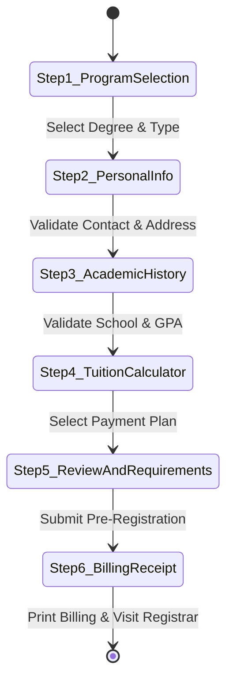

# 🎓 System #1 — Enrollment Subsystem Technical Documentation

This directory contains the source code and architectural specifications for **System #1: The Enrollment Subsystem**, developed for Go-on National College of the Philippines (GNCP) in Dasmariñas, Cavite.

---

## 📋 Subsystem Overview

The Enrollment Subsystem handles student admissions, collegiate program selections, tuition fee assessments, and enrollment pre-registrations. It is intentionally decoupled from core database infrastructure to allow seamless integration into a enterprise service bus or API gateway in later SIA phases.

---

## 🏛️ Program & Department Architecture

GNCP operates under a **College-Only** collegiate model with three primary academic departments:

| Department Code | Department Name | Offered Degree Majors |
| :--- | :--- | :--- |
| **COIT** | College of Information Technology | BS in Information Technology (BSIT) BS in Computer Science (BSCS) |
| **COBA** | College of Business Administration | BS in Business Administration (BSBA - Marketing & Finance) |
| **COED** | College of Teacher Education | Bachelor of Secondary Education (BSED - Mathematics) |

---

## 🔄 Enrollment UI Wizard Architecture

The online registration portal (`/enrollment-service/`) is constructed as a modular, state-machine driven wizard.

---

## 💡 Fee Assessment Formula Specs

Fees are dynamically computed in real-time within `App.js` using reactive computed properties:

1. **Tuition Fee:** 
   $$\text{Tuition} = \text{Units (21)} \times \text{Rate per Unit (₱1,200)} = \text{₱25,200.00}$$
2. **Miscellaneous & Laboratory Fees:** Fixed at **₱8,500.00**.
3. **Scholarship Grants (Applied to Tuition Only):**
   - **Academic Honor Graduate:** 20% Tuition Discount (-₱5,040.00)
   - **Athletic Varsity Grant:** 15% Tuition Discount (-₱3,780.00)
   - **Financial Assistance Grant:** 10% Tuition Discount (-₱2,520.00)
4. **Full Cash Discount:** 5% deduction on net assessed total.
5. **Installment Breakdown:** 30% Downpayment upon registration; remainder split over semi-annual or quarterly terms.

---

## 📂 Required Admission Documents Checklist

Matches official Philippine collegiate admission standards (based on NCST Dasmariñas guidelines):

### For Incoming Freshmen:
- [x] Form 138 / Original High School Report Card (with photocopy)
- [x] Original Certificate of Good Moral Character (with dry seal)
- [x] PSA Birth Certificate (2 photocopies)
- [x] 4 pieces recent 2x2 color pictures (white background with name tag)
- [x] 5 pieces recent 1x1 color pictures (white background with name tag)
- [x] One long brown envelope

### For College Transferees:
- [x] Certificate of Transfer Credentials / Honorable Dismissal
- [x] Official Transcript / Copy of Grades
- [x] Original Good Moral Character Certificate
- [x] PSA Birth Certificate (2 photocopies)
- [x] 4 pieces 2x2 and 2 pieces 1x1 color pictures
- [x] One long brown envelope

---

## 🔗 Next Steps for SIA System Integration

When connecting this service to the backend microservice:
1. Replace local state storage in `App.js` with `axios` / `fetch` HTTP POST requests targeting `/api/v1/enrollments`.
2. Generate secure JWT transaction tokens on submission.
3. Expose REST endpoints for the Registrar & Cashier modules to verify pre-registered student transaction IDs (`GNCP-2026-XXXXXX`).
