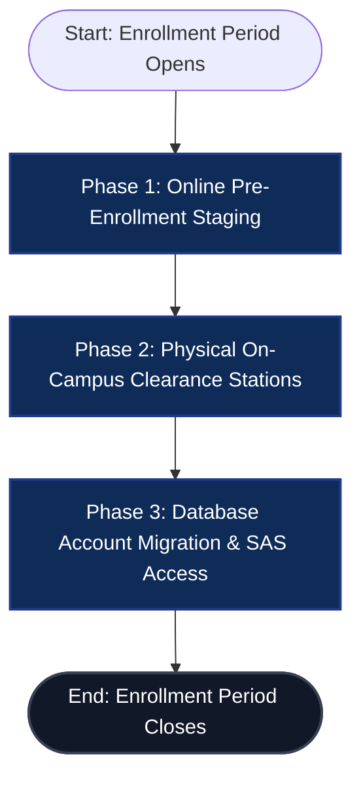
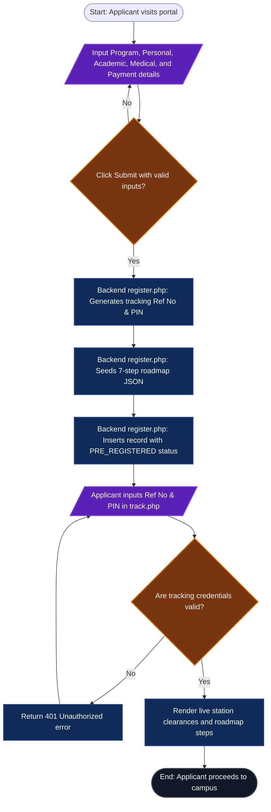
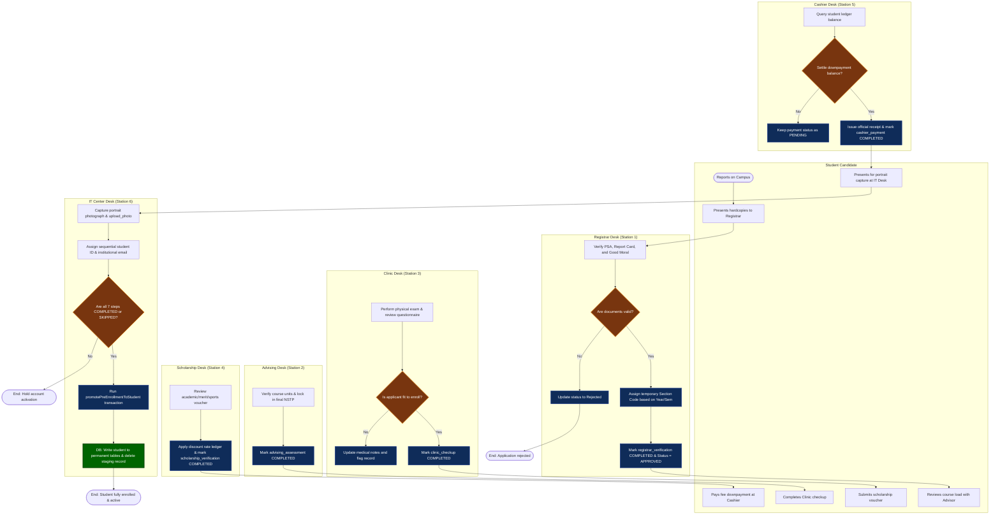
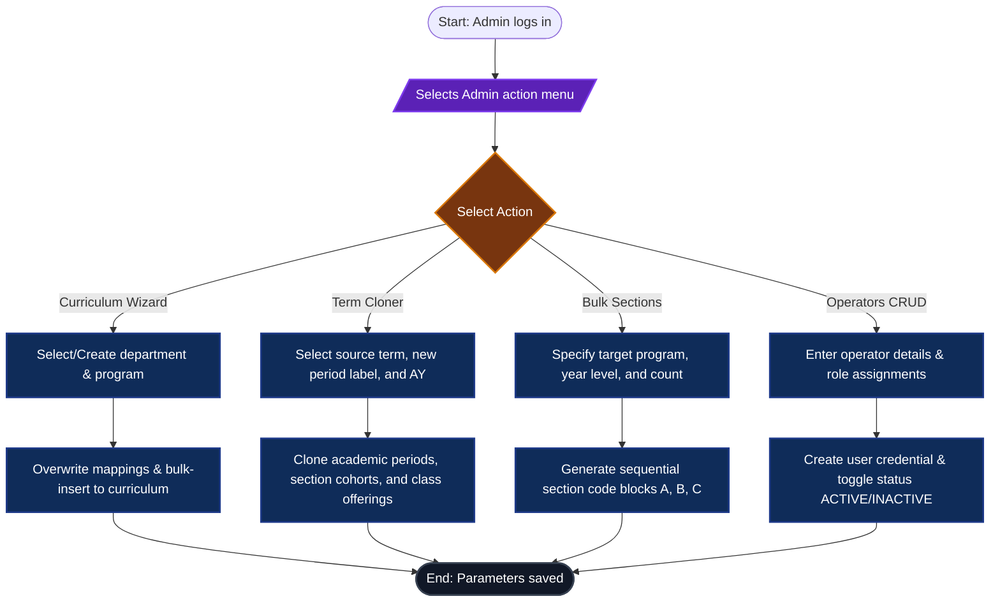
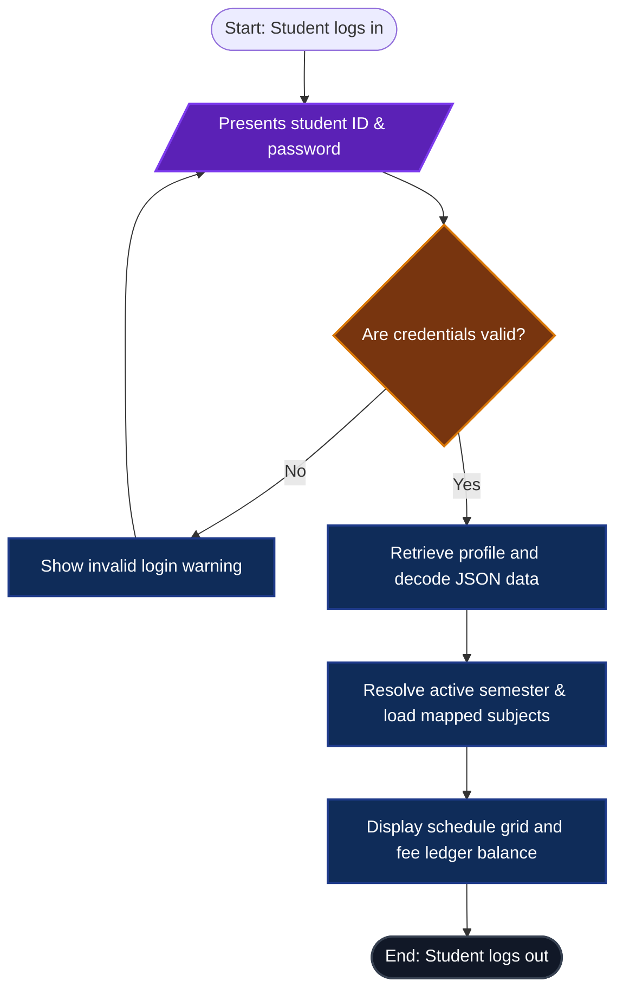

# GNCP Enrollment System: System Flowcharts & Legend

This document contains the authoritative system flowcharts for the Go-on National College of the Philippines (GNCP) Enrollment System. It is divided into a High-Level Overview flowchart and four Detailed Flowcharts for each subsystem, mapped to user roles and actual code logic.

---

## 📊 1. High-Level Overview Flowchart
Shows the high-level transitions between the different stages of the enrollment lifecycle.

---

## 📈 2. Detailed Subsystem Flowcharts

### A. Online Pre-Registration & Tracking (Guest/Candidate Swimlane)
Traces the initial data submission from the browser to the staging database and status verification.

---

### B. On-Campus Clearance Stations (Multi-Role Swimlanes)
Traces the physical clearances at each desk. Steps must be cleared before the IT Center executes final promotion.

---

### C. Super Admin Configurations (Admin Swimlane)
Traces the operations configured by the Super Admin to establish school parameters.

---

### D. Enrolled Student SAS Portal (Student Swimlane)
Traces access parameters for students to view profiles and schedule listings.

---

## 📖 3. Legend & Decision Explanations

### Swimlane Definitions
1. **Student Candidate**: Represents the prospective student applicant. They initiate the enrollment staging online and walk physically to each kiosk station on campus for validations.
2. **Registrar Desk (Station 1)**: Performed by a Registrar officer. Verifies original hardcopies and assigns a temporary Section Code (so they are temporarily mapped to a cohort but not counted in official numbers until promotion).
3. **Advising Desk (Station 2)**: Performed by an Academic Advisor. Locks in course loads and resolves NSTP choices.
4. **Clinic Desk (Station 3)**: Performed by a School Physician. Validates physical fit clearance.
5. **Scholarship Desk (Station 4)**: Performed by a Scholarship officer. Calculates ledger discount rates.
6. **Cashier Desk (Station 5)**: Performed by a Treasury clerk. Verifies fee balances and prints payment receipts.
7. **IT Center Desk (Station 6)**: Performed by an IT officer. Generates permanent accounts, captures photos, and executes database promotions.
8. **Super Admin**: Performed by the System Administrator. Governs term cloning, operator directories, and subject parameters.
9. **Student**: Represents a fully-promoted active student checking active schedules in the SAS portal.

### Core Decision Points (Diamonds)
* **SubCheck (Pre-Registration Submit)**: Verifies that form inputs comply with validation constraints before database staging.
* **TrackCheck (Status Tracking Login)**: Matches the `temp_student_id` and `temp_pin` in the database.
* **R_Decision (Registrar Validation)**: Verifies original hardcopies (Form 138, PSA). If correct, assigns a temporary Section Code based on year and semester; if incorrect, marks the application status as `Rejected`.
* **M_Decision (Medical Clearance)**: Verifies physical fitness. If unfit, flags the student record with follow-up instructions.
* **P_Check (Tuition Downpayment)**: Cashier checks if the student settled downpayments. If yes, marks cashier step `COMPLETED`.
* **IT_Check (IT Roadmap Check)**: Crucial validation loop. Checks if all roadmap checklist items are marked `COMPLETED` or `SKIPPED`. If any is pending, halts account promotion.
* **AuthCheck (Student Portal Login)**: Validates hashed password matching in the permanent `students` table.
* **Choice (Super Admin Menu)**: Routes admin parameters to catalog, term cloner, section generator, or user controls.
