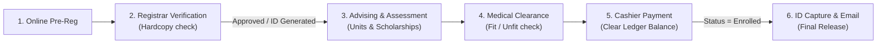

# Academic Workflow Critique: Proposed Integration vs. Real-world Operations

This critique evaluates the theoretical enrollment workflow of your system, comparing the proposed database integration flow against the actual business logic of academic institutions. It highlights bottlenecks, security risks, and logical conflicts.

---

## ⚖️ The Core Conflict: The Registration Paradox

In the proposed flow, the student pays their tuition and gets their ID card *before* the Registrar officially approves their enrollment application and generates their permanent Student ID.

```
Proposed Flow:
Pre-Registration ──► TLC Helpdesk ──► Requirements ──► Medical ──► Payment ──► ID Capture ──► Registrar Approval (Enrolled)
```

### 1. Why this is theoretically flawed (The Refund Nightmare)
In a real-world system, **no cashier accepts money from an unadmitted applicant**, and **no IT desk issues a permanent ID card to a student whose documents haven't been validated by the registrar**. 
- If a student pays at Station 5, but the Registrar rejects their birth certificate or high school report card during the final approval step, the school has to issue a **tuition refund**. Refunds in university accounting are highly restricted, require multiple approvals, and create massive paper trails.
- Generating a permanent Student ID and school email accounts for unapproved applicants exposes the school's internal digital networks (Google Workspace, Active Directory) to unauthorized users.

### 2. How Real Schools Solve This:
The Registrar's verification and approval must happen **first** (or immediately after physical document submission). 
1. The student submits papers.
2. The Registrar verifies the papers and clicks **"Admitted"**.
3. **Only then** is a permanent `student_id` generated.
4. The student uses this permanent ID to get checked by the clinic, get billed, pay the cashier, and finally print their card.

---

## 🔍 Specific Process Critiques

### 1. The Missing "Assessment of Fees" Step
- **Proposed Flow**: The student pre-registers, chooses a payment mode, and goes directly to the cashier (Station 5).
- **The Gap**: Cashiers do not calculate tuition; they only accept payments against a **Billing Ledger**. Tuition is dynamic and depends on:
  - The number of academic units enrolled.
  - Laboratory fees (computer labs, science labs have different costs).
  - Miscellaneous school fees (library, athletic, medical, registration fees).
  - Scholarship/Discount percentages (e.g., 50% academic discount).
- **Correction**: There must be an **Assessment / Advising** step *prior* to the Cashier. The system must compute the exact balance, generate an **Assessment Slip**, and save that ledger balance to the database so the Cashier can search the Student ID and see the exact amount due.

### 2. Medical Clearance: Prerequisite vs. Post-requisite
- **Proposed Flow**: Medical check-up happens at Step 4, after document verification.
- **The Gap**: For specialized programs (such as BS Nursing or BS Criminology), physical and medical fitness are **prerequisites for admission**. If a student applies for Nursing, passes document checks, pays their tuition, and *then* fails the color-blindness test or physical test at Step 4, they are stuck. They cannot proceed in that program.
- **Correction**: The system should route students conditionally:
  - For standard programs: Medical check-up is a post-requisite (can be completed concurrently or within the first month of classes).
  - For specialized programs: Medical check-up must be completed and marked `FIT` before the Registrar allows them to enroll.

### 3. Redundancy between TLC Helpdesk & Document Verification
- **Proposed Flow**:
  - *TLC Helpdesk*: NSTP program confirmation, scholarship inquiry.
  - *Requirements*: Submission of documents, NSTP submission.
- **The Gap**: The student is asked to confirm their NSTP choice and submit details at both Station 1 and Station 2. This causes data redundancy and friction.
- **Correction**: TLC Helpdesk should act purely as an *Inquiry/Advising/Technical Support* desk for outliers (walk-ins, password resets, special scholarship appeals). Standard students who pre-registered successfully online should bypass Station 1 entirely and go straight to document submission.

---

## 🔄 The Corrected Theoretical Flow (Best Practice)

For a secure and integrated system, the workflow should be re-ordered logically:



### Why this flow is robust:
1. **Zero Financial Risk**: The school never handles money for an applicant who hasn't been approved for admission.
2. **Data Integrity**: The student's billing record is computed programmatically during Assessment/Advising, so the Cashier cannot make manual input mistakes.
3. **Access Control**: School IT credentials and physical IDs are only created for students who are officially registered and paid.
